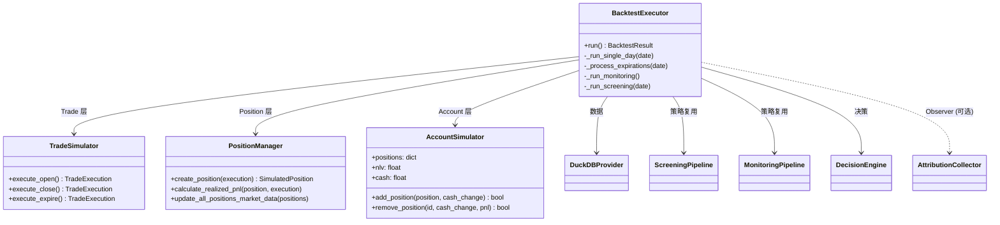
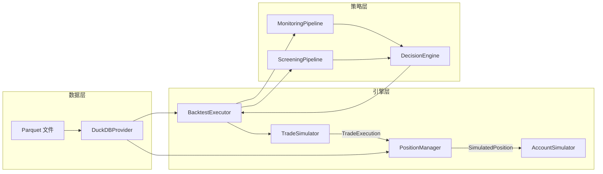
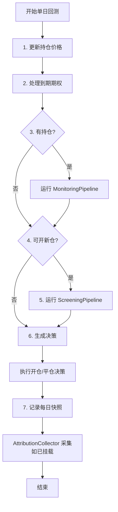

# 策略回测模块

## 概述

策略回测模块提供从历史数据获取到策略回测、归因分析和可视化报告的完整闭环。系统复用 Screening/Monitoring Pipeline 的策略逻辑，通过 `DuckDBProvider` 提供历史数据替代实时数据源，确保回测与实盘逻辑一致。

**输入**: 标的列表 + 日期范围 + 策略配置
**输出**: `BacktestResult`（含绩效指标、交易记录、归因分析）+ HTML 可视化报告
**数据来源**: ThetaData (期权/股票 EOD) + yfinance (VIX/TNX 宏观) + IBKR (基本面, 可选)

## 架构

### 目录结构

```
src/backtest/
├── data/
│   ├── thetadata_client.py           # ThetaData REST API 客户端
│   ├── greeks_calculator.py          # IV + Greeks 计算器 (Black-Scholes)
│   ├── duckdb_provider.py            # DuckDBProvider (Parquet + DuckDB)
│   ├── data_downloader.py            # 期权/股票数据下载器
│   ├── macro_downloader.py           # 宏观数据下载器 (yfinance)
│   ├── ibkr_fundamental_downloader.py # IBKR 基本面下载器
│   └── schema.py                     # 数据 Schema 定义
│
├── engine/
│   ├── backtest_executor.py          # BacktestExecutor 协调者
│   ├── trade_simulator.py            # TradeSimulator (Trade 层)
│   ├── position_manager.py           # PositionManager (Position 层)
│   └── account_simulator.py          # AccountSimulator (Account 层)
│
├── attribution/                      # Greeks 归因模块
│   ├── models.py                     # Snapshot, Attribution, SliceStats
│   ├── collector.py                  # AttributionCollector (Observer)
│   ├── pnl_attribution.py           # PnL 归因引擎
│   ├── slice_attribution.py         # 多维切片归因
│   ├── strategy_diagnosis.py        # 策略诊断 (Entry/Exit Quality)
│   └── regime_analyzer.py           # 市场环境分析
│
├── analysis/
│   └── metrics.py                    # BacktestMetrics 绩效指标
│
├── optimization/
│   └── benchmark.py                  # BenchmarkComparison (SPY 基准)
│
├── visualization/
│   ├── dashboard.py                  # BacktestDashboard (HTML 报告)
│   └── attribution_charts.py        # AttributionCharts (归因图表)
│
├── pipeline.py                       # BacktestPipeline 协调器
└── README.md
```

### 三层引擎架构



| 组件 | 层级 | 职责 |
|------|------|------|
| `BacktestExecutor` | 协调者 | 逐日迭代交易日，协调三层组件 |
| `TradeSimulator` | Trade 层 | 计算滑点和手续费，生成 `TradeExecution` |
| `PositionManager` | Position 层 | 创建持仓、计算 margin/PnL、更新市场数据 |
| `AccountSimulator` | Account 层 | 管理现金、检查保证金、存储持仓 |

### 数据流



## 核心概念

### BacktestExecutor 每日循环 7 步



### 数据层：6 阶段下载

```
1. Stock EOD (ThetaData, 按半年分块)
   ↓
2. Option EOD + Greeks (ThetaData, 按年→7天分块)
   ↓
3. Macro (yfinance: VIX, TNX, 逐指标下载)
   ↓
4. Economic Calendar (FRED + FOMC 静态日历)
   ↓
5. Fundamental (IBKR: EPS, Revenue, 可选)
   ↓
6. Rolling Beta (本地计算, 依赖 stock_daily)
```

**特性**:
- **断点续传**: 每个阶段/标的/年份独立记录进度
- **自适应限速**: 检测 429/超时后自动扩大请求间隔
- **数据验证**: 检查 parquet 数据完整性，缺失自动重新下载
- **FREE 账户兼容**: 自动限制请求日期不早于 2023-06-01

### 为什么自己计算 IV 和 Greeks

ThetaData IV/Greeks 需要 STANDARD 订阅 ($80/月)，而 FREE 账户可获取 Option EOD (bid/ask/close) 和 Stock EOD (close)。通过 `GreeksCalculator` 使用 Black-Scholes 模型反推计算：

```
已知: option_price, spot, strike, tte, rate
求解: IV (使得 BS_price(IV) = market_price)
→ 计算 Delta, Gamma, Theta, Vega (解析解)
```

精度验证：Brent 方法求解 IV 误差 < 0.0001%，Greeks 为解析解无近似。

### 与 Screening/Monitoring Pipeline 的复用

回测引擎通过 `DuckDBProvider` 的 `set_as_of_date()` 方法为 Screening/Monitoring Pipeline 提供历史数据，确保回测逻辑与实盘完全一致：

| 实盘 | 回测 |
|------|------|
| IBKR/Futu 实时数据 | `DuckDBProvider` 历史数据 |
| `ScreeningPipeline` 筛选 | 同一 Pipeline，不同数据源 |
| `MonitoringPipeline` 监控 | 同一 Pipeline，不同数据源 |
| `DecisionEngine` 决策 | 同一引擎 |

### AttributionCollector Observer 模式

`AttributionCollector` 以 Observer 模式挂载到 `BacktestExecutor`，在回测期间采集每日持仓和组合快照：

```python
collector = AttributionCollector()
executor = BacktestExecutor(config, attribution_collector=collector)
result = executor.run()
# collector 现在持有所有快照数据
```

数据采集时机：每日 monitoring step 之后，复用 `_last_monitoring_position_data`。End-of-day Greeks 作为次日 start-of-day Greeks 用于归因计算。

## 归因分析

### PnL 归因引擎

基于 Taylor 展开将每日 PnL 分解为因子贡献：

```
Daily PnL ≈ Delta × ΔS + ½ × Gamma × (ΔS)² + Theta × Δt + Vega × Δσ + Residual
```

其中：
- `delta_pnl = pd.delta * lot_size * ΔS`
- `gamma_pnl = 0.5 * pd.gamma * lot_size * (ΔS)²`
- `theta_pnl = pd.theta * lot_size * Δt`
- `vega_pnl = pd.vega * lot_size * (ΔIV × 100)`

### 切片归因维度

| 维度 | 方法 | 回答的问题 |
|------|------|-----------|
| 按标的 | `by_underlying()` | GOOG 和 SPY 各贡献了多少 PnL？ |
| 按期权类型 | `by_option_type()` | Short Call vs Short Put 谁更赚钱？ |
| 按平仓原因 | `by_exit_reason()` | 哪种止损规则效果最好？ |
| 按 IV 环境 | `by_iv_regime()` | 高 IV 开仓 vs 低 IV 开仓表现差异？ |

### StrategyDiagnosis 策略诊断

- **Entry Quality**: 开仓时机评估（IV percentile、趋势方向、事件距离）
- **Exit Quality**: 平仓时机评估（是否过早止盈、过迟止损）
- **Reversal Rate**: 平仓后标的反转概率

## 可视化

### BacktestDashboard HTML 报告（12+ 图表）

| # | 图表 | 方法 | 说明 |
|---|------|------|------|
| 1 | Equity Curve | `create_equity_curve()` | 权益曲线 + 交易标记 |
| 2 | Benchmark Comparison | `create_benchmark_comparison()` | 策略 vs SPY 累积收益 |
| 3 | Drawdown | `create_drawdown_chart()` | 回撤区域图 |
| 4 | Monthly Returns | `create_monthly_returns_heatmap()` | 月度收益热力图 |
| 5 | Asset Volume | `create_asset_volume()` | Treemap 敞口分布 |
| 6 | Symbol K-lines | `create_symbol_kline(symbol)` | 日 K 线 + 交易标记 |
| 7 | SPY K-line | `create_spy_kline()` | SPY 基准 K 线 |
| 8 | VIX K-line | `create_vix_kline()` | VIX 走势 |
| 9 | Events Calendar | `create_events_calendar()` | FOMC/CPI/NFP/GDP/PPI |
| 10 | Attribution Charts | `AttributionCharts` | 累计归因 + 每日柱状图 + Greeks 子图 + 切片对比 |
| 11 | Position Timeline | `create_trade_timeline()` | Gantt 风格持仓时间线 |
| 12 | Trade Records | `create_trade_records_table()` | 交易记录明细表 |

### AttributionCharts 归因图表

| 图表 | 说明 |
|------|------|
| Cumulative Attribution | 面积图，Delta/Gamma/Theta/Vega 累计贡献 |
| Daily Attribution Bar | 堆叠柱状图，每日各因子 PnL |
| Greeks Exposure | 2×2 子图，组合 Delta/Gamma/Theta/Vega 暴露 |
| Slice Comparison | 分组柱状图，按标的/类型/原因对比 |

可通过 `include_charts` 参数选择性生成：

```python
dashboard.generate_report(
    "report.html",
    include_charts=["equity", "drawdown", "symbol_klines", "attribution"],
)
```

## 配置

### 数据源配置

| 服务 | 用途 | 必需 |
|------|------|------|
| ThetaData Terminal | 期权/股票历史 EOD 数据 | ✅ |
| IBKR TWS (IBC) | 基本面数据 (EPS/Revenue) | 可选 |
| yfinance | 宏观数据 (VIX/TNX) | ✅（无需配置） |

### ThetaData 配置

```bash
# 安装
brew install openjdk@21
# 下载 ThetaTerminal: https://www.thetadata.net/terminal

# 启动
./scripts/ensure_thetadata.sh

# 目录结构
~/ThetaTerminal/
├── ThetaTerminalv3.jar
├── creds.txt              # email\npassword
└── config.toml
```

### IBKR TWS 配置

```bash
# 启动 Paper 账户
./scripts/ensure_tws.sh paper

# 端口配置
Paper TWS: 7497 | Paper Gateway: 4002
Live TWS:  7496 | Live Gateway:  4001
```

### 环境变量

| 变量 | 默认值 | 说明 |
|------|--------|------|
| `THETADATA_HOME` | `~/ThetaTerminal` | Terminal 安装目录 |
| `THETADATA_PORT` | `25503` | Terminal 端口 |
| `IBKR_PORT` | `7497` | TWS/Gateway 端口 |

### 保证金计算 (Reg T)

**Short Put:**
```
Margin = max(20% × Underlying - OTM Amount + Premium, 10% × Strike + Premium)
```

**Short Call:**
```
Margin = max(20% × Underlying + OTM Amount + Premium, 10% × Underlying + Premium)
```

### 滑点模型

| 期权价格 | 滑点百分比 |
|---------|-----------|
| < $0.50 | 5% |
| $0.50 ~ $5.00 | 0.1% |
| > $5.00 | 0.2% |

## CLI 命令

### Pipeline CLI

```bash
uv run backtest run [OPTIONS]
```

| 选项 | 简写 | 必填 | 默认值 | 说明 |
|------|------|------|--------|------|
| `--name` | `-n` | ✅ | - | 回测名称 |
| `--start` | `-s` | ✅ | - | 开始日期 (YYYY-MM-DD) |
| `--end` | `-e` | ✅ | - | 结束日期 (YYYY-MM-DD) |
| `--symbols` | `-S` | ✅ | - | 标的列表 (可多次指定) |
| `--data-dir` | `-d` | - | `/Volumes/ORICO/option_quant` | 数据目录 |
| `--capital` | `-c` | - | 1,000,000 | 初始资金 |
| `--skip-download` | - | - | False | 跳过数据下载 |
| `--no-report` | - | - | False | 不生成 HTML 报告 |
| `--report-dir` | - | - | `reports` | 报告输出目录 |
| `--check-only` | - | - | False | 仅检查数据状态 |
| `--verbose` | `-v` | - | False | 详细输出 |

### 数据下载脚本

```bash
# 完整下载
uv run python scripts/download_backtest_data.py

# 自定义
uv run python scripts/download_backtest_data.py \
  --symbols GOOG SPY QQQ \
  --start 2023-06-01 --end 2026-02-01

# 只下载某个阶段
uv run python scripts/download_backtest_data.py --phase stock
uv run python scripts/download_backtest_data.py --phase option

# 查看进度 / 重置
uv run python scripts/download_backtest_data.py --status
uv run python scripts/download_backtest_data.py --reset stock beta
```

### 典型示例

```bash
# 运行完整回测
uv run backtest run \
  --name "SHORT_PUT_TEST" \
  --start 2025-12-01 --end 2026-02-01 \
  --symbols GOOG --symbols SPY \
  --capital 1000000 --skip-download

# 仅检查数据状态
uv run backtest run \
  --name "TEST" --start 2025-12-01 --end 2026-02-01 \
  --symbols GOOG --check-only

# 打开报告
open reports/short_put_test_*.html
```

## Python API

### Pipeline API

```python
from datetime import date
from src.backtest import BacktestConfig, BacktestPipeline

config = BacktestConfig(
    name="MY_BACKTEST",
    start_date=date(2025, 12, 1),
    end_date=date(2026, 2, 1),
    symbols=["GOOG", "SPY"],
    initial_capital=1_000_000,
)

pipeline = BacktestPipeline(config)
pipeline.print_data_status()
result = pipeline.run(skip_data_check=False, generate_report=True)

print(f"总收益率: {result.metrics.total_return_pct:.2%}")
print(f"夏普比率: {result.metrics.sharpe_ratio:.2f}")
print(f"最大回撤: {result.metrics.max_drawdown_pct:.2%}")
```

### Executor API

```python
from src.backtest.engine import BacktestExecutor

config = BacktestConfig.from_yaml("config/backtest/short_put.yaml")
executor = BacktestExecutor(config)
result = executor.run()

print(f"Total Return: {result.total_return_pct:.2%}")
print(f"Win Rate: {result.win_rate:.1%}")
print(f"Profit Factor: {result.profit_factor:.2f}")
```

### Data API

```python
from src.backtest.data import ThetaDataClient, GreeksCalculator, DuckDBProvider

# ThetaData 客户端
client = ThetaDataClient()
options = client.get_option_eod("GOOG", start, end)
stocks = client.get_stock_eod("GOOG", start, end)

# Greeks 计算
calc = GreeksCalculator()
stock_prices = {d.date: d.close for d in stocks}
enriched = calc.enrich_options_batch(options, stock_prices, rate=0.045)

# DuckDB 数据提供者
provider = DuckDBProvider(data_dir="data/backtest")
fundamentals = provider.get_fundamental("GOOG", as_of_date=date(2024, 6, 1))
```

### Attribution API

```python
from src.backtest.attribution.collector import AttributionCollector
from src.backtest.attribution.pnl_attribution import PnLAttributionEngine
from src.backtest.attribution.slice_attribution import SliceAttributionEngine

# 带归因的回测
collector = AttributionCollector()
executor = BacktestExecutor(config, attribution_collector=collector)
result = executor.run()

# 计算归因
engine = PnLAttributionEngine(
    position_snapshots=collector.position_snapshots,
    portfolio_snapshots=collector.portfolio_snapshots,
    trade_records=result.trade_records,
)
daily_attrs = engine.compute_all_daily()
trade_attrs = engine.compute_trade_attributions()

# 切片分析
slices = SliceAttributionEngine(trade_attrs, collector.position_snapshots)
by_underlying = slices.by_underlying()
by_exit = slices.by_exit_reason()
```

## 与其他模块的集成

| 模块 | 集成方式 | 说明 |
|------|---------|------|
| **Screening** | `ScreeningPipeline` 直接复用 | 回测中用于生成开仓信号 |
| **Monitoring** | `MonitoringPipeline` 直接复用 | 回测中用于评估持仓健康 |
| **Trading** | `DecisionEngine` 复用 | 回测中用于信号→决策转换 |
| **Engine** | 所有 engine 模块复用 | Greeks 计算、策略指标、风控指标 |

## 开发指南

### 添加新数据源

1. 在 `src/backtest/data/` 创建新 downloader（如 `polygon_downloader.py`）
2. 实现下载、进度跟踪、断点续传逻辑
3. 在 `DataDownloader` 中注册新阶段
4. 在 `DuckDBProvider` 中添加数据查询方法

### 添加新分析维度

1. 在 `src/backtest/attribution/` 添加新分析器
2. 在 `SliceAttributionEngine` 中添加新切片方法
3. 在 `AttributionCharts` 中添加对应图表
4. 在 `BacktestDashboard` 中注册图表

### 添加新图表

1. 在 `src/backtest/visualization/dashboard.py` 添加 `create_xxx()` 方法
2. 使用 Plotly 构建图表（项目使用可选导入 `PLOTLY_AVAILABLE` 模式）
3. 在 `generate_report()` 的图表列表中注册
4. 添加到 `include_charts` 参数选项

## 故障排查

| 错误 | 原因 | 解决方案 |
|------|------|---------|
| `Address already in use` (25503) | ThetaData 端口被占用 | `./scripts/ensure_thetadata.sh --restart` |
| `Invalid session ID` | ThetaData 会话过期 | 重启 Terminal |
| `403 Forbidden` | 需要付费订阅 | 使用 `GreeksCalculator` 自行计算 |
| `Connection refused` (25503) | Terminal 未运行 | `./scripts/ensure_thetadata.sh` |
| `class version 65.0` | Java 版本过低 | 安装 Java 21+ (`brew install openjdk@21`) |
| `Connection refused` (7497) | TWS 未运行 | `./scripts/ensure_tws.sh paper` |
| `Not connected` | TWS API 未启用 | TWS 设置中启用 API |

## Changelog

| 日期 | 变更 |
|------|------|
| 2026-02 | 归因模块增强：Exit Quality verdict 优化、切片归因新增 IV 环境维度 |
| 2026-02 | 可视化增强：Position Timeline 移到末尾、Attribution Charts 集成 |
| 2026-02 | Pipeline CLI 工具实现、历史数据批量下载脚本 |
| 2026-02 | 归因模块实现：AttributionCollector Observer、PnL 分解、策略诊断 |
| 2026-01 | 初始版本：三层引擎架构、DuckDBProvider、BacktestDashboard |
