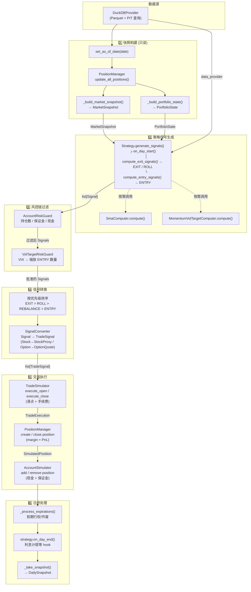

# 回测策略 V2 架构设计

> 替代旧的 `strategy_abstraction.md`，专为回测设计的策略抽象层。

## 1. 背景与动机

旧策略层 (`business/strategy/`) 以实盘为中心设计，存在 3 个核心问题：

| 问题 | 现象 | 影响 |
|------|------|------|
| **伪继承** | `BaseTradeStrategy` 依赖 ScreeningPipeline/MonitoringPipeline/PositionSizer，但 5/7 策略完全 override 三个生命周期方法 | 继承关系名存实亡 |
| **抽象缺失** | 信号生成、风控过滤、仓位计算、信号转换全揉在策略内部 | 代码重复严重 (2749 行 → 大量 copy-paste) |
| **股票 Proxy Hack** | 用 `strike=0.01, lot_size=1, dte=9999` 的假期权表示股票 | 多资产策略频繁出 bug |

**目标**：放下实盘包袱，为回测设计专用策略抽象层。

---

## 2. 系统架构

```
┌─────────────────────────────────────────────────────────────────────────┐
│                         BacktestExecutor (协调者)                         │
│  职责: 日循环 / 构建只读快照 / 调度策略 / 风控链 / 执行交易 / 记录快照      │
└──────────┬──────────────┬──────────────┬──────────────┬─────────────────┘
           │              │              │              │
     ┌─────▼─────┐  ┌────▼─────┐  ┌────▼─────┐  ┌────▼──────────┐
     │ Strategy   │  │ RiskChain│  │ Signal   │  │ Engine Layer  │
     │ (策略层)   │  │ (风控链) │  │ Converter│  │ (执行引擎层)  │
     │            │  │          │  │ (转换器) │  │               │
     │ generate_  │  │ account  │  │ Signal→  │  │ TradeSim      │
     │ signals()  │  │ position │  │ 可执行   │  │ PositionMgr   │
     │            │  │ vol_tgt  │  │ 订单     │  │ AccountSim    │
     └─────┬──────┘  └──────────┘  └──────────┘  └───────────────┘
           │
   ┌───────┴────────┐
   │ SignalComputer  │  ← 可组合的信号计算组件
   │ (信号计算器)    │     SmaComputer / MomentumComputer / ...
   └────────────────┘
```

### 目录结构

```
src/backtest/strategy/                 # 回测策略抽象层
├── __init__.py                        # 包入口，导出所有公共类
├── models.py                          # Instrument, Signal, MarketSnapshot, PortfolioState
├── protocol.py                        # StrategyProtocol + BacktestStrategy 基类
├── registry.py                        # 策略注册表
├── signal_converter.py                # Signal → TradeSignal 桥接
├── signals/                           # 可复用信号计算器
│   ├── base.py                        # SignalComputer Protocol
│   ├── sma.py                         # SMA 择时 (3 个策略复用)
│   └── momentum.py                    # 7 分动量 + VolTarget (2 个策略复用)
├── risk/                              # 可插拔风控守卫
│   ├── base.py                        # RiskGuard Protocol
│   ├── account_risk.py                # 账户级风控
│   └── vol_target_risk.py             # 波动率目标风控
└── versions/                          # 具体策略 (每个 < 200 行)
    ├── sma_stock.py                   # SMA + 股票 (合并 2 个旧策略)
    ├── sma_leaps.py                   # SMA + LEAPS Call
    ├── momentum_mixed.py              # 动量 + Stock/LEAPS 混合 (合并 2 个旧策略)
    └── short_options.py               # Short Options (桥接旧 pipeline)
```

---

## 2.5 领域模型与类体系图

```mermaid
classDiagram
    direction TB

    %% ━━━ Protocols (契约层) ━━━
    class StrategyProtocol {
        <<Protocol>>
        +name : str
        +generate_signals(market, portfolio, dp) list~Signal~
    }
    class SignalComputer {
        <<Protocol>>
        +compute(market, dp) dict
    }
    class RiskGuard {
        <<Protocol>>
        +check(signals, portfolio, market) list~Signal~
    }

    %% ━━━ 基类 ━━━
    class BacktestStrategy {
        <<Abstract>>
        #_trading_day_count : int
        #_last_signal_detail : dict
        +generate_signals(market, portfolio, dp) list~Signal~
        +on_day_start(market, portfolio) None
        +compute_exit_signals(market, portfolio, dp) list~Signal~
        +compute_entry_signals(market, portfolio, dp) list~Signal~
        +on_day_end(market, portfolio, dp) dict
        #_is_decision_day(frequency) bool
        #_rebalance_cooldown_ok(last_day, interval) bool
    }

    %% ━━━ 策略实现 ━━━
    class SmaStockStrategy {
        -_config : SmaStockConfig
        -_sma : SmaComputer
        +name : str
        +compute_exit_signals()
        +compute_entry_signals()
    }
    class SmaLeapsStrategy {
        -_config : SmaLeapsConfig
        -_sma : SmaComputer
        -_pending_roll : bool
        +compute_exit_signals()
        +compute_entry_signals()
        -_find_best_leaps() OptionQuote
    }
    class MomentumMixedStrategy {
        -_config : MomentumMixedConfig
        -_momentum : MomentumVolTargetComputer
        -_last_rebalance_day : int
        -_cumulative_interest : float
        +compute_exit_signals()
        +compute_entry_signals()
        +_compute_daily_interest(cash, date, dp) float
        -_rebalance_signals() list~Signal~
    }
    class ShortOptionsStrategy {
        -_allow_assignment : bool
        -_legacy_strategy : Any
        +uses_legacy_executor : bool
        +generate_signals() list~Signal~
        +get_legacy_strategy() Any
    }

    %% ━━━ 信号计算器 ━━━
    class SmaComputer {
        -_period : int
        -_comparison : SmaComparison
        -_short_period : int
        -_cached_date : date
        -_cached_result : dict
        +compute(market, dp) dict
    }
    class MomentumVolTargetComputer {
        -_config : MomentumConfig
        -_cached_date : date
        +compute(market, dp) dict
    }

    %% ━━━ 风控守卫 ━━━
    class AccountRiskGuard {
        -_config : AccountRiskConfig
        +check(signals, portfolio, market) list~Signal~
    }
    class VolTargetRiskGuard {
        -_config : VolTargetRiskConfig
        +check(signals, portfolio, market) list~Signal~
    }

    %% ━━━ 转换 & 注册 ━━━
    class SignalConverter {
        +convert_to_trade_signals(signals, market, dp) list~TradeSignal~
    }
    class BacktestStrategyRegistry {
        <<Singleton>>
        +create(name, **kwargs)$ StrategyProtocol
        +get_available_strategies()$ list~str~
        +register(name, factory)$ None
        +is_v2_strategy(name)$ bool
    }

    %% ━━━ 数据模型 ━━━
    class Instrument {
        <<frozen>>
        +type : InstrumentType
        +underlying : str
        +right : OptionRight?
        +strike : float?
        +expiry : date?
        +lot_size : int
        +is_stock : bool
        +is_option : bool
        +symbol : str
    }
    class Signal {
        +type : SignalType
        +instrument : Instrument
        +target_quantity : int
        +reason : str
        +position_id : str?
        +roll_to : Instrument?
        +priority : int
        +quote_price : float?
        +greeks : dict?
    }
    class MarketSnapshot {
        +date : date
        +prices : dict
        +vix : float?
        +risk_free_rate : float?
        +get_price(symbol) float
    }
    class PortfolioState {
        +date : date
        +nlv : float
        +cash : float
        +margin_used : float
        +positions : list~PositionView~
        +position_count : int
        +get_stock_positions() list
        +get_option_positions() list
    }
    class PositionView {
        +position_id : str
        +instrument : Instrument
        +quantity : int
        +entry_price : float
        +current_price : float
        +unrealized_pnl : float
        +delta / gamma / theta / vega : float?
        +dte : int?
    }

    %% ━━━ 枚举 ━━━
    class InstrumentType {
        <<enum>>
        STOCK
        OPTION
        COMBO
    }
    class SignalType {
        <<enum>>
        ENTRY
        EXIT
        REBALANCE
        ROLL
    }

    %% ═══════ 关系 ═══════

    %% Protocol 实现
    BacktestStrategy ..|> StrategyProtocol : implements
    SmaComputer ..|> SignalComputer : implements
    MomentumVolTargetComputer ..|> SignalComputer : implements
    AccountRiskGuard ..|> RiskGuard : implements
    VolTargetRiskGuard ..|> RiskGuard : implements

    %% 继承
    SmaStockStrategy --|> BacktestStrategy
    SmaLeapsStrategy --|> BacktestStrategy
    MomentumMixedStrategy --|> BacktestStrategy
    ShortOptionsStrategy --|> BacktestStrategy

    %% 组合 (拥有)
    SmaStockStrategy *-- SmaComputer
    SmaLeapsStrategy *-- SmaComputer
    MomentumMixedStrategy *-- MomentumVolTargetComputer

    %% 聚合
    PortfolioState o-- PositionView

    %% 依赖 (使用)
    Signal --> Instrument : instrument
    Signal --> Instrument : roll_to
    PositionView --> Instrument : instrument
    Signal --> SignalType
    Instrument --> InstrumentType

    %% 工厂
    BacktestStrategyRegistry ..> StrategyProtocol : creates
```



**图例说明**：
- `<<Protocol>>` 运行时可检查协议，定义最小契约
- `<<frozen>>` 不可变数据类，可做 dict key
- 实线箭头 `──>` 组合/聚合，虚线箭头 `..>` 依赖/实现
- 策略通过组合 `SignalComputer` 复用信号计算逻辑

---

## 2.6 数据流转图



**数据流要点**：
1. **只读隔离**：策略只能看到 `MarketSnapshot` 和 `PortfolioState` 快照，无法直接操作账户
2. **单向流动**：`Signal` 从策略单向流向执行引擎，中间经过风控链过滤和格式转换
3. **职责分离**：策略负责 "做什么"（Signal），引擎负责 "怎么做"（Trade Execution）
4. **可插拔风控**：`RiskGuard` 链按顺序执行，每个守卫可过滤或缩放信号

---

## 3. 核心数据模型

### 3.1 Instrument — 多资产原生支持

消除 stock proxy hack，股票/期权/组合都是一等公民。

```python
@dataclass(frozen=True)  # 不可变，可做 dict key
class Instrument:
    type: InstrumentType     # STOCK / OPTION / COMBO
    underlying: str
    right: Optional[OptionRight] = None  # CALL / PUT
    strike: Optional[float] = None
    expiry: Optional[date] = None
    lot_size: int = 100

# 示例
stock = Instrument(InstrumentType.STOCK, "SPY")
option = Instrument(InstrumentType.OPTION, "SPY", OptionRight.CALL, 450.0, date(2026, 12, 19))
```

### 3.2 Signal — 策略唯一输出

策略只描述 **做什么**，不关心 **怎么做**：

```python
class SignalType(str, Enum):
    ENTRY = "entry"        # 新建仓位
    EXIT = "exit"          # 关闭仓位
    REBALANCE = "rebalance"  # 调整数量
    ROLL = "roll"          # 展期

@dataclass
class Signal:
    type: SignalType
    instrument: Instrument
    target_quantity: int     # 正=买, 负=卖
    reason: str
    position_id: Optional[str] = None   # EXIT/ROLL 必填
    roll_to: Optional[Instrument] = None  # ROLL 专用
    priority: int = 0       # 越大越优先
    quote_price: Optional[float] = None
    greeks: Optional[dict] = None
```

### 3.3 MarketSnapshot / PortfolioState — 只读快照

策略看到的是**只读数据**，不能直接修改账户状态：

```python
@dataclass
class MarketSnapshot:
    date: date
    prices: dict[str, float]       # symbol → close
    vix: Optional[float] = None
    risk_free_rate: Optional[float] = None

@dataclass
class PortfolioState:
    date: date
    nlv: float
    cash: float
    margin_used: float
    positions: list[PositionView]   # 只读持仓视图
```

---

## 4. 核心抽象

### 4.1 StrategyProtocol — 策略最小契约

```python
@runtime_checkable
class StrategyProtocol(Protocol):
    @property
    def name(self) -> str: ...

    def generate_signals(
        self, market: MarketSnapshot, portfolio: PortfolioState, data_provider: Any,
    ) -> list[Signal]: ...
```

**一个方法搞定一切**：替代旧的 `evaluate_positions` + `find_opportunities` + `generate_entry_signals` 三步走。

### 4.2 BacktestStrategy — 便利基类

提供模板方法拆分：

```python
class BacktestStrategy:
    def generate_signals(self, market, portfolio, data_provider) -> list[Signal]:
        self._trading_day_count += 1
        self.on_day_start(market, portfolio)
        signals = []
        signals.extend(self.compute_exit_signals(market, portfolio, data_provider))
        signals.extend(self.compute_entry_signals(market, portfolio, data_provider))
        return signals

    # 子类按需 override
    def on_day_start(self, market, portfolio) -> None: pass
    def compute_exit_signals(self, market, portfolio, dp) -> list[Signal]: return []
    def compute_entry_signals(self, market, portfolio, dp) -> list[Signal]: return []
```

### 4.3 SignalComputer — 可组合信号计算器

```python
class SignalComputer(Protocol):
    def compute(self, market: MarketSnapshot, data_provider: Any) -> dict: ...
```

| 计算器 | 复用方 | 核心逻辑 |
|--------|--------|---------|
| `SmaComputer` | sma_stock, sma_leaps | SMA 计算 + price vs SMA / SMA cross 比较 |
| `MomentumVolTargetComputer` | momentum_mixed (两种配置) | 7 分动量评分 + VIX vol_scalar |

### 4.4 RiskGuard — 可插拔风控

```python
class RiskGuard(Protocol):
    def check(self, signals: list[Signal], portfolio: PortfolioState,
              market: MarketSnapshot) -> list[Signal]: ...
```

风控链作为中间件，在策略和执行之间拦截信号。

### 4.5 SignalConverter — 信号到交易的桥梁

将新 `Signal` 转换为旧 `TradeSignal`（含 OptionQuote），兼容现有执行引擎：

```python
class SignalConverter:
    def convert_to_trade_signals(self, signals: list[Signal], market: MarketSnapshot,
                                  data_provider: Any) -> list[TradeSignal]: ...
```

---

## 5. 每日执行数据流

```
BacktestExecutor._run_single_day(date)
│
├─ 1. data_provider.set_as_of_date(date)
├─ 2. position_manager.update_all_positions()
├─ 3. market  = _build_market_snapshot(date)        ← 只读
│     portfolio = _build_portfolio_state()           ← 只读
├─ 4. signals = strategy.generate_signals(market, portfolio, data_provider)
│                                                    ← 策略唯一入口
├─ 5. for guard in risk_chain:
│         signals = guard.check(signals, portfolio, market)  ← 风控过滤
├─ 6. signals.sort(key=priority)                     ← EXIT > ROLL > ENTRY
├─ 7. for signal in signals:
│         order = signal_converter.convert(signal)
│         trade_simulator.execute(order)             ← 滑点+手续费
├─ 8. _process_expirations(date)
├─ 9. strategy.on_day_end(...)                       ← 可选 hook
└─ 10. _take_snapshot(date)
```

**vs 旧流程的关键区别:**
- 策略从 3 次调用 → **1 次调用** (`generate_signals`)
- 风控从策略内部逻辑 → **独立中间件链**
- 信号从 `TradeSignal`(含执行细节) → **纯语义 `Signal`**
- 账户状态从直接暴露 → **只读快照**

---

## 6. 策略实现

### 6.1 策略映射表

| 旧策略 | 新实现 | 配置差异 |
|--------|--------|---------|
| `SpyBuyAndHoldSmaTiming` (236行) | `SmaStockStrategy(freq=1, PRICE_VS_SMA)` | 参数化 |
| `SpySma200Freq5Timing` (290行) | `SmaStockStrategy(freq=5, SMA_CROSS)` | 参数化 |
| `LongLeapsCallSmaTiming` (598行) | `SmaLeapsStrategy` | 独立 |
| `SpyMomentumLevVolTarget` (731行) | `MomentumMixedStrategy(use_stock=True)` | 参数化 |
| `SpyLeapsOnlyVolTarget` (627行) | `MomentumMixedStrategy(use_stock=False)` | 参数化 |
| `ShortOptionsWithExpire` | `ShortOptionsStrategy(allow_assignment=True)` | 桥接旧 Pipeline |
| `ShortOptionsWithoutExpire` | `ShortOptionsStrategy(allow_assignment=False)` | 桥接旧 Pipeline |

**7 个旧策略 → 4 个新策略类** (通过 Config 参数化差异)

### 6.2 SmaStockStrategy 示例 (~140 行)

```python
class SmaStockStrategy(BacktestStrategy):
    def __init__(self, config: SmaStockConfig):
        super().__init__()
        self._config = config
        self._sma = SmaComputer(period=config.sma_period, comparison=config.comparison)

    def compute_exit_signals(self, market, portfolio, dp) -> list[Signal]:
        if not portfolio.positions: return []
        result = self._sma.compute(market, dp)
        if not result["invested"] and self._is_decision_day(self._config.decision_frequency):
            return [Signal(SignalType.EXIT, pos.instrument, -pos.quantity,
                          "SMA exit", position_id=pos.position_id)
                    for pos in portfolio.positions]
        return []

    def compute_entry_signals(self, market, portfolio, dp) -> list[Signal]:
        if portfolio.positions: return []
        result = self._sma.compute(market, dp)
        if result["invested"] and self._is_decision_day(self._config.decision_frequency):
            shares = math.floor(0.95 * portfolio.cash / market.get_price(symbol))
            return [Signal(SignalType.ENTRY, Instrument(InstrumentType.STOCK, symbol),
                          shares, f"SMA entry {shares}sh")]
        return []
```

### 6.3 MomentumMixedStrategy 示例 (~500 行)

通过 `config.use_stock_component` 控制是 stock+LEAPS 还是 pure LEAPS：

```python
class MomentumMixedStrategy(BacktestStrategy):
    def __init__(self, config: MomentumMixedConfig):
        super().__init__()
        self._momentum = MomentumVolTargetComputer(config.momentum)
        # config.use_stock_component = True  → 股票 + LEAPS
        # config.use_stock_component = False → 纯 LEAPS + 现金利息

    def compute_exit_signals(self, market, portfolio, dp) -> list[Signal]:
        # LEAPS roll (DTE 过低) + 全清仓 (目标敞口=0) + 再平衡
        ...

    def compute_entry_signals(self, market, portfolio, dp) -> list[Signal]:
        # 动量评分 → vol_scalar → 目标敞口 → stock/LEAPS 分配
        ...
```

---

## 7. 策略注册表

```python
from src.backtest.strategy import BacktestStrategyRegistry

# 创建策略
strategy = BacktestStrategyRegistry.create("sma_stock")
strategy = BacktestStrategyRegistry.create("momentum_mixed")

# 使用旧名称也可以 (兼容性)
strategy = BacktestStrategyRegistry.create("spy_buy_and_hold_sma_timing")

# 查看可用策略
print(BacktestStrategyRegistry.get_available_strategies())
# ['momentum_leaps_only', 'momentum_mixed', 'short_options_with_assignment',
#  'short_options_without_assignment', 'sma_leaps', 'sma_stock',
#  'spy_buy_and_hold_sma_timing', 'spy_leaps_only_vol_target',
#  'spy_momentum_lev_vol_target', 'spy_sma200_freq5_timing', ...]
```

---

## 8. 多腿期权组合 (Phase 4, 未来扩展)

```python
# Bull Put Spread: 卖高 Put + 买低 Put
bull_put = ComboInstrument(
    name="SPY Bull Put 450/440",
    underlying="SPY",
    legs=[
        ComboLeg(Instrument(OPTION, "SPY", PUT, 450, exp), ratio=-1),
        ComboLeg(Instrument(OPTION, "SPY", PUT, 440, exp), ratio=+1),
    ],
)
```

---

## 9. 实施进度

| Phase | 状态 | 内容 |
|-------|------|------|
| Phase 0 | ✅ 完成 | 文档 (本文档 + README 更新) |
| Phase 1 | ✅ 完成 | 基础设施 (models, protocol, signals, risk, converter) |
| Phase 2 | ✅ 完成 | 策略迁移 (4 个新策略 + registry) |
| Phase 3 | 🔲 待做 | 引擎重构 (executor 集成新策略入口) |
| Phase 4 | 🔲 待做 | 多腿扩展 (ComboInstrument + 组合保证金) |

### 代码量对比

| 维度 | 旧代码 | 新代码 | 变化 |
|------|--------|--------|------|
| 策略代码 | 2749 行 (7 个类) | 1246 行 (4 个类) | -55% |
| 基础设施 | 0 行 | 962 行 (models/protocol/signals/risk/converter) | 新增可复用组件 |
| 测试 | 0 行 | 28 个测试用例 | 新增 |

---

## 10. 关键文件索引

| 文件 | 用途 |
|------|------|
| `src/backtest/strategy/models.py` | Instrument, Signal, MarketSnapshot, PortfolioState |
| `src/backtest/strategy/protocol.py` | StrategyProtocol + BacktestStrategy 基类 |
| `src/backtest/strategy/signals/sma.py` | SmaComputer (SMA 择时信号) |
| `src/backtest/strategy/signals/momentum.py` | MomentumVolTargetComputer (动量 + vol target) |
| `src/backtest/strategy/risk/account_risk.py` | AccountRiskGuard (账户级风控) |
| `src/backtest/strategy/risk/vol_target_risk.py` | VolTargetRiskGuard (波动率目标风控) |
| `src/backtest/strategy/signal_converter.py` | Signal → TradeSignal 桥接 |
| `src/backtest/strategy/versions/sma_stock.py` | SMA + 股票策略 |
| `src/backtest/strategy/versions/sma_leaps.py` | SMA + LEAPS Call 策略 |
| `src/backtest/strategy/versions/momentum_mixed.py` | 动量混合策略 (stock+LEAPS / pure LEAPS) |
| `src/backtest/strategy/versions/short_options.py` | Short Options 桥接策略 |
| `src/backtest/strategy/registry.py` | 策略注册表 |
| `tests/backtest/test_strategy_v2.py` | V2 策略单元测试 (28 用例) |
