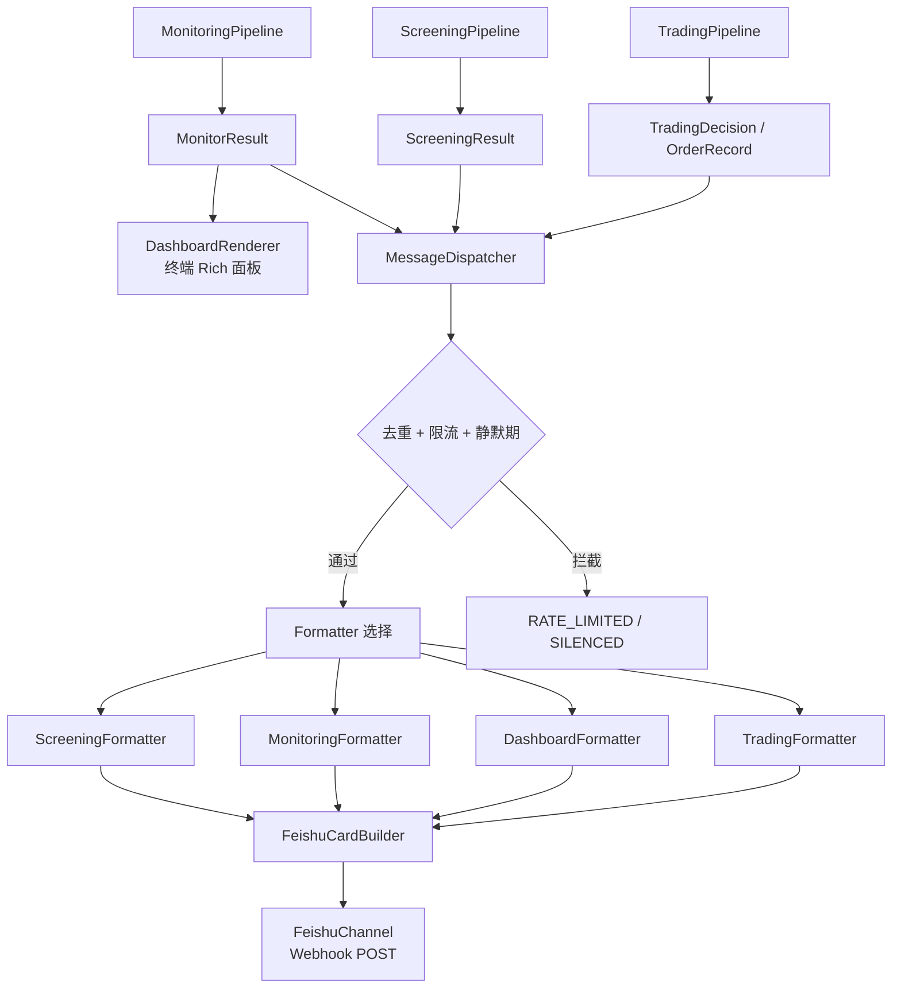

# 仪表盘与 IM 消息

## 概述

本模块包含两个子系统：**Terminal Dashboard**（终端仪表盘）和 **Notification**（IM 消息推送）。Dashboard 在终端渲染实时持仓面板，Notification 通过飞书 Webhook 推送预警和报告。两者共享 `MonitorResult` 作为数据源，但渲染目标不同。

**输入**: `MonitorResult`（监控结果）、`ScreeningResult`（筛选结果）、`TradingDecision[]` / `OrderRecord[]`（交易数据）
**输出**: 终端 Rich 面板 / 飞书卡片消息

## 架构

### 目录结构

```
src/business/notification/
├── dispatcher.py                      # MessageDispatcher 消息分发
├── channels/
│   ├── base.py                        # NotificationChannel 抽象 + SendResult
│   └── feishu.py                      # FeishuChannel + FeishuCardBuilder
└── formatters/
    ├── screening_formatter.py         # 筛选结果格式化
    ├── monitoring_formatter.py        # 监控预警格式化
    ├── dashboard_formatter.py         # 每日报告格式化
    └── trading_formatter.py           # 交易决策/执行结果格式化

src/business/cli/
├── commands/
│   └── dashboard.py                   # CLI 入口
└── dashboard/
    ├── renderer.py                    # DashboardRenderer 终端渲染
    ├── components.py                  # UI 组件（进度条、表格、图标）
    └── threshold_checker.py           # ThresholdChecker 阈值评估

config/notification/
└── feishu.yaml                        # 飞书配置
```

### 数据流



## 核心概念

### MessageDispatcher 消息分发

`MessageDispatcher` 是通知系统的核心，负责去重、限流和路由：

| 机制 | 实现 | 默认值 |
|------|------|--------|
| **去重** | MD5 hash 前 16 字符 + 时间窗口 | 1800 秒（30 分钟） |
| **限流** | 两次发送最小间隔 | 60 秒 |
| **静默期** | 时间段内阻止发送 | 23:00 ~ 07:00 (Asia/Shanghai) |
| **强制发送** | `force=True` 跳过所有检查 | - |

**关键方法**:

| 方法 | 输入 | 说明 |
|------|------|------|
| `send_screening_result(result)` | `ScreeningResult` | 推送筛选机会 |
| `send_monitoring_result(result)` | `MonitorResult` | 推送监控预警（按 alert 级别） |
| `send_dashboard_result(result)` | `MonitorResult` | 推送每日综合报告 |
| `send_trade_decisions(decisions)` | `list[TradingDecision]` | 推送交易决策 |
| `send_trade_results(results)` | `list[OrderRecord]` | 推送执行结果 |
| `send_alert(alert)` | `Alert` | 推送单条预警 |

### NotificationChannel 抽象

```python
class NotificationChannel(ABC):
    @property
    def name(self) -> str: ...          # 渠道名称
    @property
    def is_available(self) -> bool: ... # 可用性检查
    def send(self, title, content) -> SendResult: ...      # 文本消息
    def send_card(self, card_data) -> SendResult: ...      # 卡片消息
```

**SendStatus 枚举**: `SUCCESS` | `FAILED` | `RATE_LIMITED` | `SILENCED`

### FeishuChannel 实现

飞书渠道通过 Webhook POST 发送消息：

- **签名安全**: HMAC-SHA256 签名（可选，配置 secret 后启用）
- **速率控制**: 实例级 1 秒最小间隔
- **重试机制**: 最多 3 次，指数退避（1s → 3s → 9s）

### FeishuCardBuilder 卡片构建

静态方法工厂，构建飞书交互卡片结构：

| 方法 | 用途 |
|------|------|
| `create_header(title, color)` | 卡片头部（blue/green/orange/red/grey） |
| `create_text_element(content)` | Markdown 文本元素 |
| `create_fields(fields)` | 多列字段布局 |
| `create_divider()` | 水平分隔线 |
| `create_note(content)` | 底部注释 |
| `create_alert_card(...)` | 预警卡片 |
| `create_opportunity_card(...)` | 机会卡片（含详细指标行） |
| `create_monitor_report_card(...)` | 监控报告卡片 |

## 5 种 Formatter

### ScreeningFormatter

格式化筛选结果为飞书卡片。只发送 `result.confirmed`（二次确认）的合约。

**特性**:
- **Diversification**: 使用 round-robin 策略分散跨标的展示（默认最多 10 个机会）
- **三种场景**: 有机会 → 机会卡片 / 无机会 → 完成卡片 / 市场不利 → 观望卡片

**机会卡片每行格式**:
```
#1 TSLA PUT 485 @ 2026-02-06 (DTE=18)
P0/P1/P2: ExpROC, AnnROC, WinProb, TGR, Θ/Margin
P3: Sharpe, PremRate, Kelly
Market: S, Premium, Moneyness, Bid/Ask, Vol, IV
Greeks: Δ, Γ, Θ, V, OI, OTM
```

### MonitoringFormatter

按预警级别格式化监控结果：

| Alert Level | 方法 | 卡片颜色 |
|------------|------|---------|
| RED | `format_risk_alert()` | 红色 |
| YELLOW | `format_attention_alert()` | 橙色 |
| GREEN | `format_opportunity_alert()` | 绿色 |

### DashboardFormatter

格式化每日综合报告（最复杂的 Formatter），包含 11 个表格：

1. 状态概览（🟢/🟡/🔴）
2. Capital 四大支柱
3. Portfolio Greeks 概览
4. 期权持仓详情表
5. Greeks 表
6. 核心指标表（E[Return], MaxProf/Loss, BE, WinProb）
7. 风险调整表（PREI, SAS, TGR, ROC, Sharpe, Kelly）
8. 资本与保证金表
9. 正股市场表
10. 基本面表
11. 技术面表

### TradingFormatter

格式化交易决策和执行结果：

**决策卡片**:
```
#1 🟢 OPEN NVDA PUT K=120 Exp=2025-02-21 [NORMAL]
Qty: -1 | Price: $2.50 | Priority: NORMAL
💡 Rationale text
🔄 展期到: 2025-03-21 K=125 Credit=$0.50  (ROLL 类型)
```

**执行结果卡片**:
```
✅ NVDA PUT K=120 | IBKR#12345 | Submitted
Side: BUY | Qty: 1 | Price: Market
成交: 1 @ $2.45 | 佣金: $2.00
```

颜色映射: 全部成功 → 绿色 / 全部失败 → 红色 / 混合 → 橙色

## Terminal Dashboard

### DashboardRenderer 面板布局

```
┌─────── Portfolio Health ──────┐  ┌──── Capital Risk Control ─────┐
│ BWD%:    +0.15 [████░░░░] 🟢 │  │ Margin Util: 25.0%        🟢 │
│ Gamma%:  -0.002           🟢 │  │ Cash Ratio:  35.0%        🟢 │
│ Vega%:   +0.004           🟢 │  │ Gross Lev:   1.8x         🟢 │
│ Theta%:  +0.002           🟢 │  │ Stress Loss: 8.0%         🟢 │
│ TGR:     0.50             🟢 │  └────────────────────────────────┘
│ HHI:     0.25             🟢 │
│ IV/HV:   1.20             🟢 │
└───────────────────────────────┘

┌──────── Risk Heatmap ─────────┐  ┌──────── Today's Todo ─────────┐
│      AAPL  TSLA  SPY   NVDA  │  │ 🚨 [NVDA] Close expiring put │
│ TGR  0.50  0.45  0.42  0.08  │  │ ⚡ [TSLA] Monitor margin     │
│ E[ROC] 2.5% 3.0% 3.5% -1.2% │  │ 👁️ [SPY] Watch support       │
└───────────────────────────────┘  └────────────────────────────────┘

┌──────────────────── Option Positions ────────────────────────────┐
│ Table 1: Position Info (标的, 策略, Strike, DTE, OTM%, PnL%)    │
│ Table 2: Greeks (Delta, Gamma, Theta, Vega, HV, IV, IV/HV)     │
│ Table 3: Core Metrics (E[Ret], MaxProf, MaxLoss, BE, WinPr)    │
│ Table 4: Risk-Adjusted (PREI, SAS, TGR, ROC, Sharpe, Kelly)    │
│ Table 5: Capital & Margin (Margin, Cap@Risk, ReturnStd)        │
└──────────────────────────────────────────────────────────────────┘

 总持仓: 7 | 风险持仓: 1 | 机会持仓: 0 | 预警: 🔴0 🟡1 🟢0
```

### ThresholdChecker

为 Dashboard 面板提供指标 → AlertLevel 映射：

| 检查方法 | 指标 | 绿/黄/红 阈值 |
|---------|------|--------------|
| `check_margin_utilization()` | 保证金使用率 | ≤40% / 40-70% / >70% |
| `check_cash_ratio()` | 现金留存率 | ≥30% / 10-30% / <10% |
| `check_gross_leverage()` | 总名义杠杆 | <2x / 2-4x / >4x |
| `check_stress_test_loss()` | 压力测试 | <10% / 10-20% / >20% |
| `check_delta_pct()` | BWD% | ±20% / ±20-50% / >50% |
| `check_tgr()` | TGR | ≥1.5 / 1.0-1.5 / <1.0 |
| `check_concentration()` | HHI | <0.25 / 0.25-0.5 / >0.5 |
| `get_position_overall_level()` | 综合评估 | 多指标加权 |

### UI 组件 (`components.py`)

| 函数 | 用途 |
|------|------|
| `progress_bar(value, min, max)` | 生成 `[████░░░░░░]` 样式进度条 |
| `alert_icon(level)` | 🔴 / 🟡 / 🟢 / ⚪ |
| `urgency_icon(urgency)` | 🚨 / ⚡ / 👁️ / 📌 |
| `format_metric(value, fmt)` | 数值格式化（含前缀后缀） |
| `side_by_side(left, right)` | 两列面板水平拼接 |
| `table_header() / table_row()` | 对齐表格渲染 |

## 配置

### 飞书配置

```yaml
# config/notification/feishu.yaml
webhook:
  url_env: "FEISHU_WEBHOOK_URL"
  secret_env: "FEISHU_WEBHOOK_SECRET"
  timeout: 10

rate_limit:
  min_interval: 60
  dedup_window: 1800
  silent_hours:
    enabled: true
    start: "23:00"
    end: "07:00"
    timezone: "Asia/Shanghai"

retry:
  max_attempts: 3
  initial_delay: 1
  backoff_multiplier: 3

content:
  max_opportunities: 10
  alert_levels: [red, yellow, green]

templates:
  screening_opportunity_title: "📈 {strategy} 开仓机会"
  screening_no_opportunity_title: "📊 筛选完成 - 暂无机会"
  market_unfavorable_title: "⚠️ 市场环境不利 - 建议观望"
  risk_alert_title: "🔴 风险预警 - {alert_type}"
  attention_alert_title: "🟡 关注提醒 - {alert_type}"
  monitor_report_title: "📋 持仓监控报告"
```

### 环境变量

```bash
export FEISHU_WEBHOOK_URL="https://open.feishu.cn/open-apis/bot/v2/hook/xxx"
export FEISHU_WEBHOOK_SECRET="your_secret_here"  # 可选但推荐
```

## CLI 命令

### Dashboard 命令

```bash
python src/business/cli/main.py dashboard [OPTIONS]
```

| 参数 | 简写 | 默认值 | 说明 |
|------|------|--------|------|
| `--account-type` | `-a` | (sample) | 账户类型：paper, live |
| `--ibkr-only` | | False | 仅使用 IBKR |
| `--futu-only` | | False | 仅使用 Futu |
| `--refresh` | `-r` | 0 | 自动刷新间隔（秒，0=单次渲染） |
| `--verbose` | `-v` | False | 详细日志 |
| `--push` / `--no-push` | | False | 渲染后推送飞书 |

### 典型示例

```bash
# 使用示例数据（无需连接券商）
optrade dashboard

# Paper 账户实时刷新
optrade dashboard -a paper --refresh 30

# Live 账户 + 推送飞书
optrade dashboard -a live --push

# 仅 IBKR 数据
optrade dashboard -a paper --ibkr-only
```

## Python API

```python
from src.business.notification.dispatcher import MessageDispatcher
from src.business.notification.channels.feishu import FeishuChannel

# 初始化
channel = FeishuChannel.from_env()
dispatcher = MessageDispatcher(channel=channel)

# 推送筛选结果
dispatcher.send_screening_result(screening_result)

# 推送监控预警
dispatcher.send_monitoring_result(monitor_result)

# 推送每日报告
dispatcher.send_dashboard_result(monitor_result)

# 推送交易决策
dispatcher.send_trade_decisions(decisions, dry_run=True)

# 推送执行结果
dispatcher.send_trade_results(order_records)

# 强制发送（跳过去重/限流/静默期）
dispatcher.send_alert(alert, force=True)
```

## 与其他模块的集成

| 上游模块 | 提供数据 | Formatter |
|---------|---------|-----------|
| **Screening** | `ScreeningResult` | `ScreeningFormatter` |
| **Monitoring** | `MonitorResult` | `MonitoringFormatter` + `DashboardFormatter` |
| **Trading** | `TradingDecision[]` / `OrderRecord[]` | `TradingFormatter` |

Dashboard 和 Notification 不产生数据流向下游，是系统的终端输出节点。

## 开发指南

### 添加新通知渠道（如 Telegram）

1. 在 `src/business/notification/channels/` 创建 `telegram.py`
2. 继承 `NotificationChannel` 抽象基类
3. 实现 `send()` 和 `send_card()` 方法
4. 在 `config/notification/` 添加渠道配置文件
5. 在 `MessageDispatcher` 中注入新 Channel 实例

```python
class TelegramChannel(NotificationChannel):
    @property
    def name(self) -> str:
        return "telegram"

    @property
    def is_available(self) -> bool:
        return bool(self._bot_token)

    def send(self, title: str, content: str, **kwargs) -> SendResult:
        # Telegram Bot API 调用
        ...

    def send_card(self, card_data: dict) -> SendResult:
        # Telegram 不支持卡片，转为富文本
        ...
```

### 添加新 Formatter

1. 在 `src/business/notification/formatters/` 创建新 Formatter
2. 实现 `format()` 方法，返回飞书卡片 dict
3. 在 `MessageDispatcher` 中添加对应的 `send_xxx()` 方法
4. 使用 `FeishuCardBuilder` 构建卡片结构

### 添加新 Dashboard 面板

1. 在 `DashboardRenderer` 中添加 `_render_xxx_panel()` 方法
2. 使用 `components.py` 的辅助函数（`progress_bar`、`side_by_side`、`table_*`）
3. 在 `render()` 主方法中注册新面板
4. 如需阈值评估，在 `ThresholdChecker` 中添加检查方法
