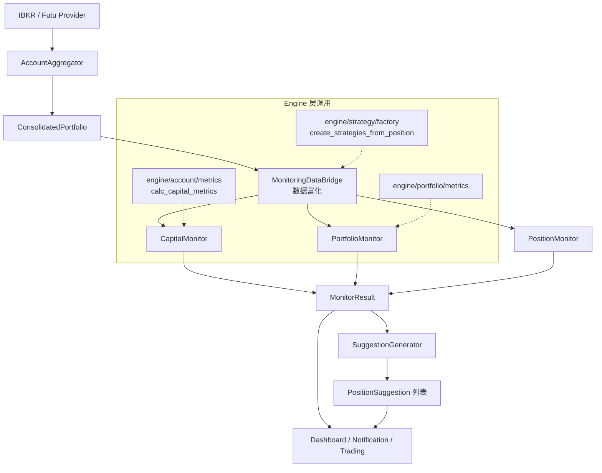

# 持仓监控模块

## 概述

持仓监控模块负责对已建立的期权/股票持仓进行实时风险评估和行动建议生成。系统采用**三级监控架构**（Capital → Portfolio → Position），从账户生存到单一持仓逐层检查，输出红黄绿三色预警和操作建议。

**输入**: `ConsolidatedPortfolio`（多券商合并后的持仓数据）
**输出**: `MonitorResult`（含 `Alert[]` 预警列表 + `PositionSuggestion[]` 操作建议）
**下游消费者**: Trading 模块（自动平仓/展期）、Dashboard（终端仪表盘）、Notification（飞书推送）

## 架构

### 目录结构

```
src/business/monitoring/
├── monitors/
│   ├── capital_monitor.py        # 资本级监控（4 大风控支柱）
│   ├── portfolio_monitor.py      # 组合级监控（Greeks 敞口）
│   └── position_monitor.py       # 持仓级监控（9 个核心指标）
├── models.py                     # Alert, MonitorResult 等数据模型
├── data_bridge.py                # MonitoringDataBridge 数据富化
├── suggestions.py                # SuggestionGenerator 建议生成
├── roll_calculator.py            # Roll 计算器（展期参数）
└── pipeline.py                   # MonitoringPipeline 协调器

src/business/config/
└── monitoring_config.py          # 阈值配置与数据类

config/monitoring/
└── thresholds.yaml               # 阈值自定义覆盖
```

### 数据流



### 与 Engine 层的调用关系

| Engine 模块 | 函数 | 用途 |
|------------|------|------|
| `engine/account/metrics` | `calc_capital_metrics()` | 计算 Margin Utilization、Cash Ratio、Gross Leverage、Stress Test |
| `engine/portfolio/metrics` | 组合 Greeks 归一化 | BWD%、Gamma%、Vega%、Theta%、TGR、HHI |
| `engine/strategy/factory` | `create_strategies_from_position()` | 识别策略类型，计算 TGR、ROC、Expected ROC、Win Prob |

## 核心概念

### 三级监控

| 级别 | 监控器 | 关注点 | 核心问题 |
|------|--------|--------|---------|
| **Capital** | `CapitalMonitor` | 账户生存 | 会不会爆仓？流动性够吗？ |
| **Portfolio** | `PortfolioMonitor` | 整体风险 | Greeks 敞口是否均衡？ |
| **Position** | `PositionMonitor` | 单一持仓 | 这笔交易还值得持有吗？ |

### 红黄绿灯预警体系

| 颜色 | 含义 | 行动 |
|------|------|------|
| 🟢 绿色 | 正常 | 无需操作 |
| 🟡 黄色 | 关注 | 准备调整 |
| 🔴 红色 | 风险 | 立即行动 |

### ThresholdRange 迟滞设计

阈值配置使用 `ThresholdRange`，支持绿/黄/红区间定义，避免指标在边界值附近频繁切换预警级别：

```yaml
# config/monitoring/thresholds.yaml
capital_level:
  margin_utilization:
    green: [0, 0.40]
    yellow: [0.40, 0.70]
    red_above: 0.70
```

### DataBridge 数据富化

`MonitoringDataBridge` 将券商原始持仓 (`AccountPosition`) 转换为监控所需的 `PositionData`：

1. 计算派生指标：OTM%、DTE、P&L%
2. 调用 Engine 层获取策略指标（TGR、ROC、Expected ROC、Win Prob）
3. 丰富技术面/基本面数据

### SuggestionGenerator 建议生成

根据 Alert 列表生成可操作的 `PositionSuggestion`，包含：
- `ActionType`: CLOSE / ROLL / REDUCE / HEDGE / HOLD / MONITOR
- `urgency`: IMMEDIATE / SOON / MONITOR
- `trigger_alerts`: 触发该建议的预警列表

## 指标体系

### Capital Level（4 大风控支柱）

| 指标 | 公式 | 🟢 绿色 | 🟡 黄色 | 🔴 红色 | 红色时操作 |
|------|------|---------|---------|---------|-----------|
| **Margin Utilization** | Maint Margin / NLV | < 40% | 40%~70% | > 70% | 强制去杠杆 |
| **Cash Ratio** | Net Cash / NLV | > 30% | 10%~30% | < 10% | 停止开仓 |
| **Gross Leverage** | (Σ\|Stock\| + Σ\|Option Notional\|) / NLV | < 2.0x | 2.0x~4.0x | > 4.0x | 缩减规模 |
| **Stress Test Loss** | (Current\_NLV - Stressed\_NLV) / Current\_NLV<br/>场景: Spot -15% 且 IV +40% | < 10% | 10%~20% | > 20% | 买入尾部保护 |

**为什么是这四个指标**:
1. Margin Utilization → **现在**会不会死（防爆仓）
2. Cash Ratio → **操作**灵不灵活（防卡死）
3. Gross Leverage → **规模**控没控制住（防虚胖）
4. Stress Test Loss → **未来**会不会死（防黑天鹅）

### Portfolio Level（NLV 归一化 Greeks）

| 指标 | 物理意义 | 🟢 绿色 | 🟡 黄色 | 🔴 红色 | 红色时操作 |
|------|---------|---------|---------|---------|-----------|
| **BWD%** | 方向性杠杆 | ±20% | ±20%~50% | >50% 或 <-50% | Delta 对冲 |
| **Gamma%** | 凸性风险 | > -0.1% | -0.1%~-0.3% | < -0.5% | 买入保护性 Put |
| **Vega%** | 波动率风险 | ±0.3% | ±0.3%~0.6% | < -0.5% | 买入 VIX Call |
| **Theta%** | 日时间衰减率 | 0.05%~0.15% | 0.15%~0.25% | >0.30% 或 <0% | 平仓部分 Short |
| **IV/HV** | 持仓定价质量 | >1.0 | 0.8~1.2 | <0.8 | 停止做空 |
| **TGR** | Theta/Gamma 效率 | ≥1.5 | 1.0~1.5 | <1.0 | 调整持仓结构 |
| **HHI** | 集中度指数 | <0.25 | 0.25~0.5 | >0.5 | 分散持仓 |

### Position Level（9 个核心指标）

| 指标 | 公式 | 🟢 绿色 | 🟡 黄色 | 🔴 红色 | 红色时操作 |
|------|------|---------|---------|---------|-----------|
| **OTM%** | Put: (Spot-Strike)/Spot<br/>Call: (Strike-Spot)/Spot | ≥10% | 5%~10% | <5% | 立即 Roll |
| **\|Delta\|** | 期权 Delta 绝对值 | ≤0.20 | 0.20~0.40 | >0.50 | 对冲或平仓 |
| **DTE** | 到期天数 | ≥14 天 | 7~14 天 | <7 天 | 强制平仓/展期 |
| **P&L%** | 盈亏 / 原始权利金 | ≥50% | -100%~50% | <-100% | 无条件止损 |
| **Gamma Risk%** | Gamma / Margin | ≤0.5% | 0.5%~1% | >1% | 减仓 |
| **TGR** | \|Theta\| / (\|Gamma\| × S² × σ\_daily) × 100 | ≥1.5 | 1.0~1.5 | <1.0 | 平仓换合约 |
| **IV/HV** | 隐含波动率 / 历史波动率 | ≥1.2 | 0.8~1.2 | <0.8 | 提前止盈 |
| **Expected ROC** | 预期资本回报 | ≥10% | 0%~10% | <0% | 立即平仓 |
| **Win Prob** | 理论胜率 | ≥70% | 55%~70% | <55% | 考虑平仓 |

## 配置

### 配置文件

阈值配置位于 `config/monitoring/thresholds.yaml`，可根据个人风险偏好调整：

```yaml
capital_level:
  margin_utilization:
    green: [0, 0.35]      # 更保守
    yellow: [0.35, 0.60]
    red_above: 0.60

position_level:
  dte:
    green: [21, .inf]     # 要求更长 DTE
    yellow: [14, 21]
    red_below: 14
```

### 关键文件

| 文件 | 说明 |
|------|------|
| `src/business/config/monitoring_config.py` | 阈值默认值与数据类定义 |
| `config/monitoring/thresholds.yaml` | 阈值自定义覆盖 |
| `src/business/monitoring/data_bridge.py` | 数据转换桥接 |
| `src/business/monitoring/monitors/` | 三级监控器实现 |
| `src/business/monitoring/suggestions.py` | 建议生成器 |
| `src/business/monitoring/roll_calculator.py` | 展期参数计算 |

## CLI 命令

```bash
python src/business/cli/main.py monitor [OPTIONS]
```

| 参数 | 简写 | 默认值 | 说明 |
|------|------|--------|------|
| `--account-type` | `-a` | paper | 账户类型：paper, live |
| `--verbose` | `-v` | False | 详细日志 |

### 典型示例

```bash
# Paper 账户监控
python src/business/cli/main.py monitor --account-type paper

# Live 账户监控（详细模式）
python src/business/cli/main.py monitor --account-type live -v

# Dashboard 实时刷新模式
python src/business/cli/main.py dashboard --account-type live --refresh 30
```

### 输出示例

```
=== Capital Level ===
  保证金使用率正常: 35.2%           🟢
  现金留存率充足: 42.1%             🟢
  总名义杠杆正常: 1.8x              🟢
  压力测试亏损可控: 8.5%            🟢

=== Position Alerts ===
  AAPL250117P180: DTE < 7 天: 5 天   🔴 → 强制平仓或展期
  GOOG250117C345: |Delta| 偏大: 0.35 🟡 → 关注方向性风险
```

## Python API

```python
from src.business.monitoring.pipeline import MonitoringPipeline
from src.business.monitoring.data_bridge import MonitoringDataBridge

# 方式 1: 使用 Pipeline
pipeline = MonitoringPipeline(account_type="paper")
result = pipeline.run()

# 访问预警
for alert in result.alerts:
    print(f"{alert.level} {alert.source}: {alert.message}")

# 访问建议
for suggestion in result.suggestions:
    print(f"[{suggestion.urgency}] {suggestion.action_type}: {suggestion.reason}")

# 方式 2: 使用 DataBridge 手动转换
bridge = MonitoringDataBridge(data_provider, ibkr_provider, futu_provider)
position_list = bridge.convert_positions(portfolio)
```

## 与其他模块的集成

| 下游模块 | 消费数据 | 说明 |
|---------|---------|------|
| **Trading** | `MonitorResult.suggestions` | `DecisionEngine.process_monitor_signal()` 将建议转为 CLOSE/ROLL/ADJUST 决策 |
| **Dashboard** | `MonitorResult` | `DashboardRenderer` 渲染终端面板 |
| **Notification** | `MonitorResult` | `MonitoringFormatter` 格式化飞书预警卡片；`DashboardFormatter` 格式化每日报告 |
| **Backtest** | `MonitoringPipeline` | `BacktestExecutor` 复用监控逻辑评估持仓健康状况 |

### 数据采集层

| 组件 | 职责 | 输出 |
|------|------|------|
| `IBKRProvider` | 连接盈透证券获取持仓、Greeks、市场数据 | `AccountPosition[]` |
| `FutuProvider` | 连接富途证券获取 HK 期权持仓 | `AccountPosition[]` |
| `AccountAggregator` | 合并多券商持仓、货币转换 (HKD→USD)、补充 Greeks | `ConsolidatedPortfolio` |

## 开发指南

### 添加新 Monitor

1. 在 `src/business/monitoring/monitors/` 创建新文件（如 `correlation_monitor.py`）
2. 实现 Monitor 类，接收 `PositionData[]`，返回 `MonitorResult`
3. 在 `MonitoringPipeline` 中注册新 Monitor
4. 在 `monitoring_config.py` 添加阈值配置
5. 在 `thresholds.yaml` 中添加可覆盖配置

### 添加新指标

1. 在对应 Monitor 中增加检查逻辑
2. 在 `monitoring_config.py` 中定义阈值区间
3. 如需 Engine 层计算，在对应 engine 模块添加计算函数
4. 更新 `DataBridge` 确保数据富化流程覆盖新指标

## Changelog

| 日期 | 变更 |
|------|------|
| 2026-01-23 | Position 级指标从 12 个精简为 9 个（移除 PREI、SAS、ROC）；P&L% 止损线调整为 -100%；TGR 阈值更新为标准化公式；新增 Win Probability；新增策略差异化阈值 |
| 2026-01-08 | 重构资本级监控，引入四大核心风控指标；修复 HK 期权 underlying_price 获取问题；添加 Futu fallback 和 HKD→USD 货币转换 |
