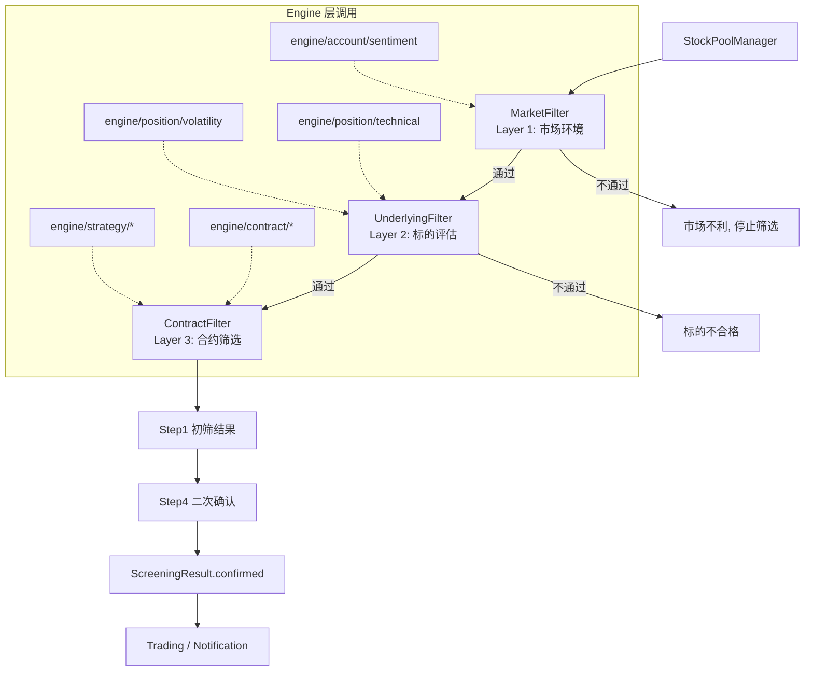

# 开仓筛选模块

## 概述

开仓筛选模块负责从市场中捕捉期权卖方开仓机会。系统采用**三层漏斗架构**（Market → Underlying → Contract），逐层过滤不合格标的和合约，最终输出按资金效率排序的 `ContractOpportunity` 列表。

**输入**: 股票池配置 + 市场实时数据（行情、期权链、宏观事件）
**输出**: `ScreeningResult`（含 `confirmed` 二次确认合约列表）
**下游消费者**: Trading 模块（自动交易）、Notification 模块（飞书推送）

支持 **Short Put (CSP)** 和 **Covered Call (CC)** 两种策略，覆盖美股和港股市场。

## 架构

### 目录结构

```
src/business/screening/
├── filters/
│   ├── market_filter.py          # Layer 1: 市场环境过滤
│   ├── underlying_filter.py      # Layer 2: 标的过滤
│   └── contract_filter.py        # Layer 3: 合约过滤
├── models.py                     # ContractOpportunity 等数据模型
├── pipeline.py                   # ScreeningPipeline 协调器
└── stock_pool.py                 # StockPoolManager 股票池管理

src/business/config/
└── screening_config.py           # 默认值和数据类定义

config/screening/
├── stock_pools.yaml              # 股票池定义
├── short_put.yaml                # Short Put 策略配置
└── covered_call.yaml             # Covered Call 策略配置
```

### 数据流



### 与 Engine 层的调用关系

| Engine 模块 | 用途 | 调用位置 |
|------------|------|---------|
| `engine/account/sentiment` | VIX 水平、期限结构、Put/Call Ratio | MarketFilter |
| `engine/position/technical` | RSI、ADX、均线排列 | UnderlyingFilter |
| `engine/position/volatility` | IV Rank、IV/HV Ratio | UnderlyingFilter |
| `engine/contract/greeks` | Delta、Gamma、Theta、Vega | ContractFilter |
| `engine/contract/metrics` | Expected ROC、TGR、Sharpe | ContractFilter |
| `engine/strategy/factory` | 策略识别与收益计算 | ContractFilter |

## 核心概念

### 三层漏斗

| 层级 | 过滤器 | 核心问题 | 过滤对象 |
|------|--------|---------|---------|
| **Layer 1** | `MarketFilter` | 现在是卖期权的好时机吗？ | 市场环境 |
| **Layer 2** | `UnderlyingFilter` | 这个标的适合卖期权吗？ | 股票池中每个标的 |
| **Layer 3** | `ContractFilter` | 选择哪个 Strike 和到期日？ | 每个标的的期权合约 |

### 二次确认机制

筛选流程包含两轮确认：
1. **Step 1（初筛）**: 三层 Filter 执行，输出候选合约
2. **Step 4（确认）**: 对 Step 1 结果做二次校验，最终输出 `ScreeningResult.confirmed`

Notification 和 Trading 模块只消费 `confirmed` 列表。

### 优先级体系 (P0–P3)

| 优先级 | 含义 | 处理方式 | 示例 |
|--------|------|---------|------|
| **P0** | 致命条件 | 不满足 = 立即排除，无例外 | 期望收益为负 |
| **P1** | 核心条件 | 不满足 = 强烈建议不开仓 | VIX 极端、流动性不足、IV Rank 偏低 |
| **P2** | 重要条件 | 不满足 = 警告，需其他条件补偿 | RSI 超买超卖、Annual ROC 不足 |
| **P3** | 参考条件 | 不满足 = 可接受，记录风险 | Sharpe Ratio、Premium Rate |

## 指标体系

### Layer 1: 市场环境指标

| 指标 | 优先级 | 条件 | 说明 |
|------|--------|------|------|
| 宏观事件 | P1 | FOMC/CPI/NFP 前 3 天 | 事件前暂停新开仓 |
| VIX 水平 | P1 | 15~28 (SP) / 12~25 (CC) | <15 保费太低，>30 风险大 |
| VIX 期限结构 | P1 | VIX/VIX3M < 1.0 | >1.0 反向结构 = 近期黑天鹅预期 |
| VIX Percentile | P2 | 20%~80% | 50%-80% 最佳 |
| SPY/盈富趋势 | P2 | 符合策略方向 | Short Put 要求看涨/震荡 |
| Put/Call Ratio | P2 | 0.8~1.2 | 极端值预示市场转折 |

**美股检查项**: VIX 水平和期限结构、VIX Percentile、SPY 趋势、Put/Call Ratio、宏观事件日历 (FOMC/CPI/NFP)

**港股检查项**: VHSI 或 2800.HK ATM IV、IV Percentile、盈富基金趋势、美股宏观事件

### Layer 2: 标的指标

| 指标 | 优先级 | 条件 | 说明 |
|------|--------|------|------|
| 财报日期 | P1 | > 7 天或合约在财报前到期 | 避免财报博弈 |
| **IV Rank** | **P1** | > 30% | **阻塞条件**，卖方必须卖"贵"的东西 |
| IV/HV Ratio | P1 | 0.8~2.0 | 隐含波动率相对历史波动率 |
| RSI | P2 | 30~70 | 避免超买超卖区域 |
| ADX | P2 | < 45 | 避免强趋势行情 |
| 除息日 (CC) | P2 | > 7 天 | 仅 Covered Call 检查 |

### Layer 3: 合约指标

| 指标 | 优先级 | 条件 | 说明 |
|------|--------|------|------|
| Annual Expected ROC | P0 | > 10% | 年化期望收益率，**致命条件** |
| TGR | P1 | > 0.5 | Theta/Gamma 比率（标准化） |
| DTE | P1 | 7~45 天 | 港股到期日稀疏，范围宽松 |
| \|Delta\| | P1 | 0.05~0.35 | 最优 0.20~0.30 |
| Bid-Ask Spread | P1 | < 10% | 流动性指标 |
| Open Interest | P1 | > 100 | 持仓量 |
| OTM% | P2 | 7%~30% | 虚值百分比 |
| Annual ROC | P2 | > 15% | 年化收益率 |
| Sharpe Ratio | P3 | > 0.5 | 参考条件 |
| Premium Rate | P3 | > 1% | 参考条件，已被 Annual ROC 包含 |
| Win Probability | P3 | > 65% | 理论胜率 |
| Volume | P3 | > 10 | 当日成交量 |
| **Theta/Margin** | **排序** | - | **资金效率排序指标**，用于对通过筛选的合约排序 |

## 配置

### 配置优先级

**YAML 文件 > `screening_config.py` 默认值**

| 场景 | 修改文件 |
|------|---------|
| 调整两种策略共用的默认值 | `src/business/config/screening_config.py` |
| 调整 Short Put 特有参数 | `config/screening/short_put.yaml` |
| 调整 Covered Call 特有参数 | `config/screening/covered_call.yaml` |
| 添加/修改股票池 | `config/screening/stock_pools.yaml` |
| 添加新配置项 | `screening_config.py` + 对应 YAML |

### 策略配置示例

**Short Put** (`config/screening/short_put.yaml`):

```yaml
market_filter:
  us_market:
    vix_range: [15, 28]
    trend_required: "bullish_or_neutral"
  hk_market:
    iv_range: [18, 32]
    trend_required: "bullish_or_neutral"

underlying_filter:
  min_iv_rank: 50
  technical:
    min_rsi: 30
    rsi_stabilizing_range: [30, 45]
```

**Covered Call** (`config/screening/covered_call.yaml`):

```yaml
market_filter:
  us_market:
    vix_range: [12, 25]
    trend_required: "neutral_or_bearish"
  hk_market:
    iv_range: [15, 28]
    trend_required: "neutral_or_bearish"

underlying_filter:
  min_iv_rank: 40
  technical:
    rsi_exhaustion_range: [55, 70]
```

### 默认合约配置

```python
# src/business/config/screening_config.py

@dataclass
class ContractFilterConfig:
    dte_range: tuple[int, int] = (7, 45)
    optimal_dte_range: tuple[int, int] = (25, 45)
    delta_range: tuple[float, float] = (0.05, 0.35)
    optimal_delta_range: tuple[float, float] = (0.20, 0.30)
    otm_range: tuple[float, float] = (0.07, 0.30)

@dataclass
class LiquidityConfig:
    max_bid_ask_spread: float = 0.10   # 10%
    min_open_interest: int = 100
    min_volume: int = 10

@dataclass
class MetricsConfig:
    min_sharpe_ratio: float = 0.5      # P3
    min_tgr: float = 0.5              # P1
    min_expected_roc: float = 0.10    # P0 (10%)
    min_annual_roc: float = 0.15      # P2 (15%)
    min_win_probability: float = 0.65 # P3 (65%)
    min_premium_rate: float = 0.01    # P3 (1%)
```

## CLI 命令

```bash
python src/business/cli/main.py screen [OPTIONS]
```

| 参数 | 简写 | 默认值 | 说明 |
|------|------|--------|------|
| `--market` | `-m` | all | 市场：us, hk, all |
| `--strategy` | `-s` | all | 策略：short_put, covered_call, all |
| `--pool` | `-p` | (默认池) | 股票池名称 |
| `--symbols` | `-S` | (无) | 指定标的（可多次使用） |
| `--output` | `-o` | text | 输出格式：text, json |
| `--push` | | False | 推送结果到飞书 |
| `--skip-market-check` | | False | 跳过市场环境检查（调试用） |
| `--verbose` | `-v` | False | 详细模式 |
| `--list-pools` | | False | 列出所有可用股票池 |

### 典型示例

```bash
# 日常扫描（默认配置）
python src/business/cli/main.py screen

# 只看美股 Short Put 机会
python src/business/cli/main.py screen -m us -s short_put

# 调试单个标的
python src/business/cli/main.py screen -S AAPL --skip-market-check -v

# JSON 输出用于程序处理
python src/business/cli/main.py screen -o json > opportunities.json

# 扫描后推送飞书通知
python src/business/cli/main.py screen --push
```

## Python API

```python
from src.business.screening import ScreeningPipeline, StockPoolManager, MarketType

# 方式 1: 使用 Pipeline
pipeline = ScreeningPipeline(market="us", strategy="short_put")
result = pipeline.run()

for opp in result.confirmed:
    print(f"{opp.symbol} K={opp.strike} DTE={opp.dte} "
          f"ExpROC={opp.expected_roc:.1%} TGR={opp.tgr:.2f}")

# 方式 2: 管理股票池
manager = StockPoolManager()
symbols = manager.load_pool("us_large_cap")
pools = manager.list_pools()
default = manager.get_default_pool(MarketType.US)
```

### 数据路由策略

| 数据类型 | US 市场 | HK 市场 |
|----------|---------|---------|
| 股票行情 | IBKR → Futu → Yahoo | IBKR → Futu |
| 期权链 | IBKR → Futu → Yahoo | IBKR → Futu |
| Greeks | IBKR → Futu | IBKR → Futu |
| 波动率 | IBKR → Futu → Yahoo | IBKR → Futu |
| 宏观数据 | Yahoo (VIX) | Yahoo (VHSI) |
| 经济日历 | FRED + 静态 FOMC | FRED + 静态 FOMC |

## 与其他模块的集成

| 下游模块 | 消费数据 | 说明 |
|---------|---------|------|
| **Trading** | `ScreeningResult.confirmed` | `DecisionEngine.process_screen_signal()` 将机会转为 OPEN 决策 |
| **Notification** | `ScreeningResult` | `ScreeningFormatter` 格式化飞书卡片推送 |
| **Backtest** | `ScreeningPipeline` | `BacktestExecutor` 复用筛选逻辑，通过 `DuckDBProvider` 提供历史数据 |

## 开发指南

### 添加新 Filter

1. 在 `src/business/screening/filters/` 创建新文件（如 `sentiment_filter.py`）
2. 实现 Filter 类，遵循现有接口模式（接收数据，返回通过/拒绝 + 原因）
3. 在 `ScreeningPipeline` 中注册新 Filter
4. 在 `screening_config.py` 添加对应配置项
5. 在策略 YAML 中添加差异化配置

### 添加新市场

1. 在 `MarketType` 枚举中新增市场标识
2. 在 `MarketFilter` 中实现市场专属检查逻辑
3. 在 `stock_pools.yaml` 中添加新市场股票池
4. 配置数据路由（选择合适的 DataProvider）

## Changelog

| 版本 | 日期 | 变更 |
|------|------|------|
| 2.1 | 2026-01 | 同步指标阈值，完善配置说明 |
| 2.0 | 2025-01 | 统一合约配置，简化 CLI 默认行为 |
| 1.2 | 2025-01 | 添加事件日历集成，港股 DTE 范围优化 |
| 1.1 | 2025-01 | 添加股票池管理 (StockPoolManager) |
| 1.0 | 2025-01 | 初始版本：三层过滤器框架 |
