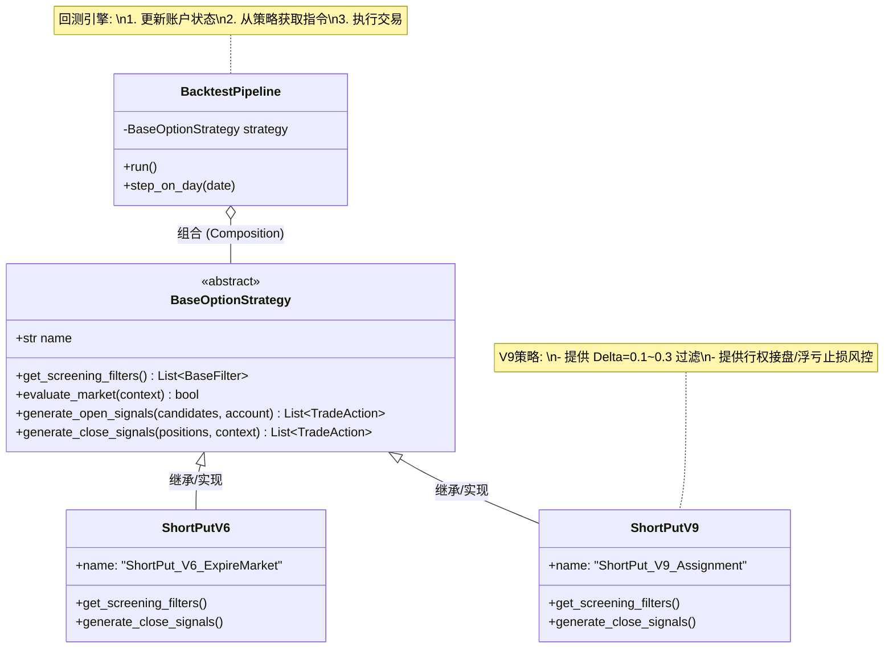
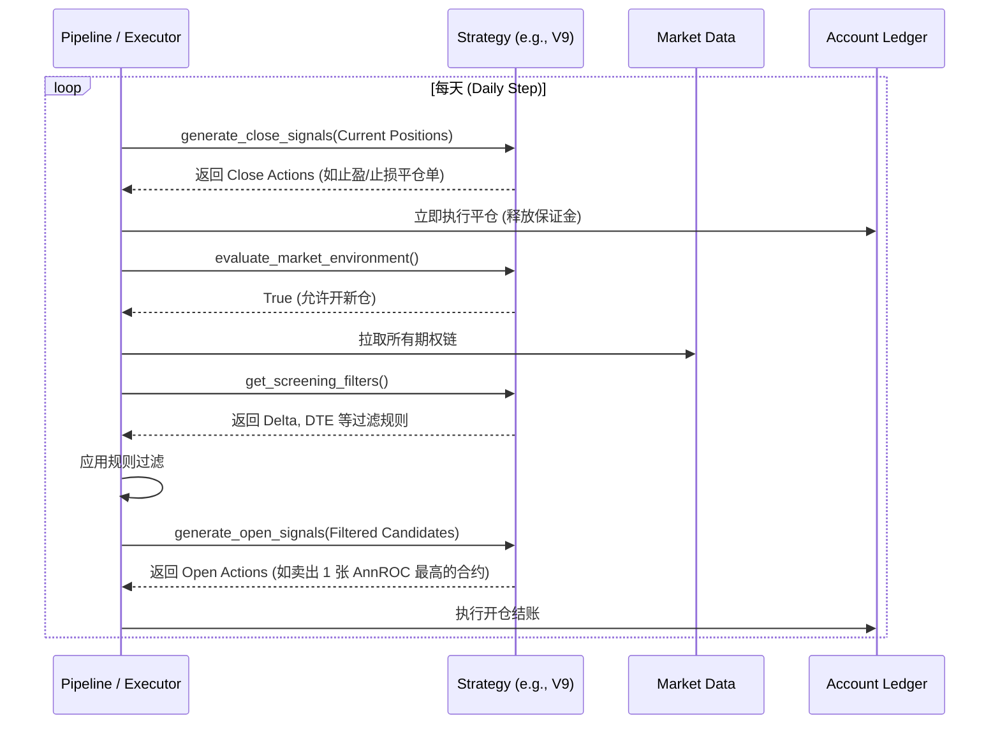

# 策略抽象与多版本共存架构设计

## 1. 背景与痛点

随着项目从简单的单一策略演进至包含多个复杂版本（如 V6、V8、V9），当前系统架构暴露出了“策略硬编码”的严重耦合问题：

* **逻辑严重分散**：策略逻辑散落在 `screening`（标的/合约过滤）、`monitoring`（盯盘预警/止盈止损）、`trading`（信号生成）三个独立流水线中。
* **版本覆盖迭代**：在开发新版本（如 V9）时，直接修改了底层监控和回测组件，导致旧版本（如 V6）逻辑被永久覆盖。
* **A/B 测试缺失**：系统无法做到“传入 V6 跑 V6，传入 V9 跑 V9”，丧失了并行对比不同策略版本的核心量化能力。

因此，引入一个强有力的**策略抽象层 (Strategy Abstraction Layer)** 势在必行。

---

## 2. 外部框架评估：为什么不直接采用 Qlib？

在引入策略框架时，我们对比了业内最知名的开源框架微软 Qlib。其核心思想（`BaseStrategy` 抽象）非常优秀，但**将其作为底层引擎直接替换现有系统则是一个巨大的风险**：

| 特性维度 | 开源机器学习框架 (如 Qlib/Backtrader) | 我们的 Option Quant 原生引擎 | 结论 |
| :--- | :--- | :--- | :--- |
| **资产类别** | 专为大规模股票 (Equity) 截面因子设计 | 专为期权 (Option) 设计，原生支持希腊字母 | **极度不匹配**。Qlib 无法处理期权的非线性特征（Delta/Gamma）。 |
| **底层账本** | 极简股票仓位，只有买/卖/持有 | 支持复杂的保证金、期权行权、内在价值现金交割（V9 Fix） | **无法迁移**。Qlib 账本算不清楚被 Assign 时的账户交割现金流。 |
| **设计思想** | 数据 -> 因子模型 -> 资金分配 -> BaseStrategy | Pipeline -> {筛选 -> 监控 -> 交易} -> Account | **思想可借鉴**。我们只需提取其 BaseStrategy 模型，嫁接到我们的原生管线之上。 |

**核心决策：学习 Qlib 的接口设计哲学，在原生高性能“期权账本”之上实现我们的 `BaseOptionStrategy` 引擎。**

---

## 3. 架构重构设计方案

### 3.1 核心思想
我们将所有涉及到主观判断的“策略规则（Rule-based Data）”从执行层抽离，收敛到一个统管全局的插槽对象——`BaseOptionStrategy` 中。
引擎（Pipeline）只负责“执行（Execute）”机制，不做任何“决策（Decide）”。所有的 Decide 均由注入的策略实例负责。

### 3.2 架构类图 (Architecture Diagram)



---

### 3.3 模块交互流转 (Sequence Diagram)

重构后，回测中每一天的完整流转将由 `Pipeline` 驱动，并向具体的 `Strategy` 发起多次状态轮询：



---

## 4. 目录结构与接口定义

### 4.1 目录划分
我们在 `src/business/` 下新增 `strategy` 模块，管理所有的版本实现：

```text
src/
└── business/
    └── strategy/
        ├── __init__.py
        ├── base.py                   # 定义 BaseOptionStrategy 抽象类
        ├── models.py                 # 定义 Signal, Filter 等策略内部通讯对象
        ├── factory.py                # 工厂模式：根据字符串名称分发实例化
        └── versions/                 # 各个并行存在的策略池
            ├── __init__.py
            ├── short_put_v6.py       # V6：到期市价平仓版
            ├── short_put_v8.py       # V8：DTE<21平仓版
            └── short_put_v9.py       # V9：行权接股票终极版
```

### 4.2 接口抽象 (Pseudo-code)

```python
from abc import ABC, abstractmethod

class BaseOptionStrategy(ABC):
    
    @property
    @abstractmethod
    def name(self) -> str:
        """策略的唯一标识符，用于报表和注册"""
        pass
        
    # ==========================
    # 阶段 1：平仓监控与风控决策
    # ==========================
    @abstractmethod
    def evaluate_positions(self, positions: list[SimulatedPosition], context: MarketContext) -> list[TradeSignal]:
        """
        替代过去的 PortfolioMonitor。
        策略根据自己的逻辑判断持仓是否需要平仓 (如 V6=到期平，V9=提前拿利润)。
        """
        pass

    # ==========================
    # 阶段 2：开仓条件与标的筛选
    # ==========================
    @abstractmethod
    def is_market_favorable(self, context: MarketContext) -> bool:
        """大盘条件检测 (如 V9 拒绝强上涨趋势的卖 Call)"""
        pass

    @abstractmethod
    def get_contract_filters(self) -> list[BaseFilter]:
        """返回本次策略该用的合约过滤器集合"""
        pass

    # ==========================
    # 阶段 3：建仓信号生成
    # ==========================
    @abstractmethod
    def generate_entry_signals(self, candidates: list[OptionQuote], account: AccountSimulator) -> list[TradeSignal]:
        """决定最终买/卖哪个合约，买几张（包含资金管理逻辑）"""
        pass
```

---

## 5. 重构工作拆解路线 (Roadmap)

我们建议按照以下 4 个阶段分步重构，确保每次提交都能安全跑通：

**Phase 1: 骨架搭建 (Foundation)**
* 在 `src/business/strategy/` 创建上述 `BaseOptionStrategy` 和目录结构。
* 将当前的 Screening Criteria、监控参数、交易逻辑参数化到基类所需的组件中。

**Phase 2: 建立 V9 实现并移植代码 (V9 Porting)**
* 创建 `short_put_v9.py`。
* 将当前硬编码在 `monitoring/pipeline.py`、`decision/engine.py` 中的具体业务规则全部 Ctrl+X 到 `ShortPutV9` 的方法中。
* *此时系统业务依然只有 V9 一个版本，但已经由策略对象承载。*

**Phase 3: Pipeline 引擎重构 (Engine Refactor)**
* 彻底改造 `src/backtest/pipeline.py`。
* 删除在引擎层实例化的 Monitor/Screener，改为接收 `strategy` 对象，用 `strategy.evaluate_positions()` 等方法进行状态流转。

**Phase 4: 多版本复兴 (Multi-Version Rebirth)**
* 在 `versions/` 下创建 `short_put_v6.py` 和 `short_put_v8.py`。
* 在 `cli/commands/run.py` 中引入 `StrategyFactory`。
* 增加启动参数：`uv run backtest run --strategy V6` 和 `--strategy V9`。

## 6. 单元测试方案 (Unit Testing Strategy)

引入抽象层后，系统迎来了绝佳的可测试性提升：引擎与策略规则彻底解耦。单元测试分为两个核心轴：

### 6.1 策略规则层测试 (Logic Tests)
策略层没有任何副作用（不修改账户金额），本质是一个**“纯函数” (Pure Functions)**，这使得测试非常简单：输入持仓和行情，断言输出的交易信号。

* **测试框架**: `pytest` + `unittest.mock`
* **用例集**: `tests/business/strategy/versions/test_short_put_v9.py`
* **测试用例示例**:
  1. **止损/止盈测试**: 构造一个浮亏 120% 的 `SimulatedPosition`，传入 `ShortPutV9.evaluate_positions()`，断言返回的列表中是否包含 `TradeAction.CLOSE` 信号以及正确的止损理由类型。
  2. **选股约束测试**: 构造一个 VIX 飙升、SPY 跌破均线的 `MarketContext`，调用 `is_market_favorable()`，断言返回 `False`。
  3. **建仓选取测试**: 提供 10 个模拟的 `OptionQuote`，调用 `generate_entry_signals()`，断言返回的是 AnnROC 最高的那个深度虚值 PUT 信号。

### 6.2 引擎插槽测试 (Engine Mock Tests)
测试 `BacktestPipeline` 时，我们不需要载入真实的复杂 V9 策略，而是通过 Mock 一个 FakeStrategy，来验证引擎是否以正确的时序轮询策略接口，并在收到信号后正确更新原生账本：

* **用例集**: `tests/backtest/engine/test_pipeline_orchestration.py`
* **测试用例示例**:
  1. 创造一个 `FakeStrategy`，强制让其 `evaluate_positions` 永远返回平掉所有仓位的信号。
  2. 运行 `pipeline.step_on_day()`。
  3. 断言底层账户持仓（AccountSimulator）变成了空仓，并且保证金正确释放。
