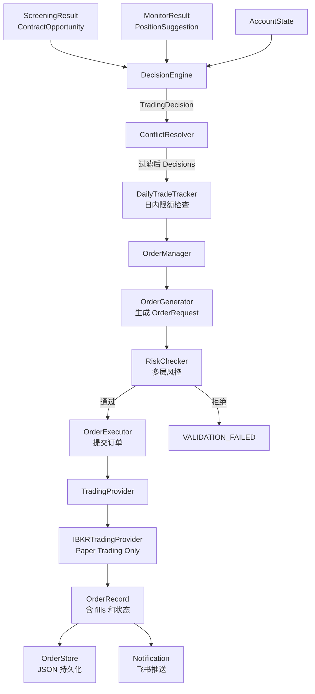
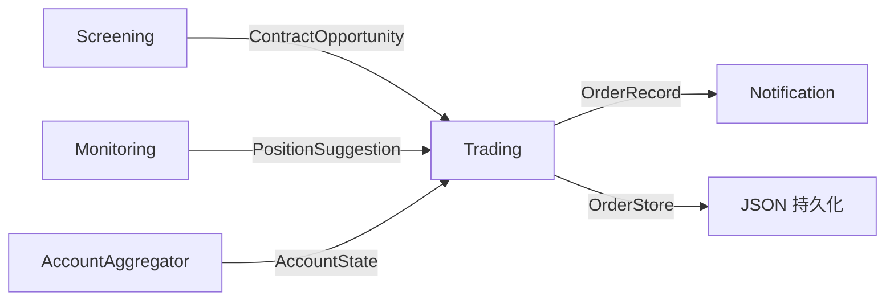

# 自动交易模块

## 概述

自动交易模块作为 Screening（开仓筛选）和 Monitoring（持仓监控）系统的下游，实现信号到订单的闭环。模块采用**四层架构**（Pipeline → DecisionEngine → OrderManager → TradingProvider），通过多层风控确保交易安全。

**输入**: `ScreeningResult`（开仓信号）+ `MonitorResult`（平仓/调整信号）+ `AccountState`
**输出**: `OrderRecord[]`（订单执行记录）
**关键约束**: **仅支持 Paper Trading（模拟账户）**，硬性权限控制

## 架构

### 目录结构

```
src/business/trading/
├── pipeline.py                    # TradingPipeline 协调器
├── account_bridge.py              # Portfolio → AccountState 转换
├── daily_limits.py                # DailyTradeTracker 日内限额
├── config/
│   ├── decision_config.py         # 决策引擎配置
│   ├── order_config.py            # 订单管理配置
│   └── risk_config.py             # 风控限额配置
├── decision/
│   ├── engine.py                  # DecisionEngine 决策引擎
│   ├── account_analyzer.py        # AccountStateAnalyzer 账户分析
│   ├── position_sizer.py          # PositionSizer (Kelly-based)
│   └── conflict_resolver.py       # ConflictResolver 冲突解决
├── order/
│   ├── manager.py                 # OrderManager 订单管理
│   ├── generator.py               # OrderGenerator 订单生成
│   ├── risk_checker.py            # RiskChecker 风控检验
│   └── store.py                   # OrderStore (JSON 持久化)
├── models/
│   ├── decision.py                # TradingDecision, AccountState, PositionContext
│   ├── order.py                   # OrderRequest, OrderRecord, OrderFill
│   └── trading.py                 # TradingResult, TradingAccountType
└── provider/
    ├── base.py                    # TradingProvider 抽象基类
    └── ibkr_trading.py            # IBKRTradingProvider (Paper Only)

src/business/cli/commands/
└── trade.py                       # CLI 命令

config/trading/
├── decision.yaml                  # 决策引擎设置
├── order.yaml                     # 订单管理设置
├── risk.yaml                      # 风控限额
└── execution.yaml                 # 执行模式设置
```

### 数据流



## 核心概念

### 四层安全架构

| 层级 | 组件 | 职责 | 关键检查 |
|------|------|------|---------|
| **Layer 1** | Decision Engine | 账户级门控 | margin < 70%、cash > 10%、leverage < 4x |
| **Layer 2** | Decision Engine | 持仓级限制 | 单标的合约数、名义价值占比、总持仓数 |
| **Layer 3** | Order Manager | 订单级验证 | 保证金预测、价格偏离、数量限制、账户类型 |
| **Layer 4** | Trading Provider | 券商级保障 | IBKR 端口限制、账户前缀校验 |

### Paper-Only 安全约束

系统通过**多层硬性校验**确保永远不会触发实盘交易：

1. `TradingAccountType` 枚举**仅定义 PAPER**（不存在 REAL 选项）
2. `TradingProvider.__init__()` 校验 account_type == PAPER
3. 每次 `submit_order()` 前调用 `_validate_paper_account()`
4. IBKR 只连接 7497/4002 端口（Paper）；**禁止** 7496/4001（Live）
5. 账户 ID 前缀校验（Paper 账户以 "DU" 开头）

### DecisionEngine 三子模块

| 子模块 | 类 | 职责 |
|--------|------|------|
| 账户分析 | `AccountStateAnalyzer` | 判断账户是否允许新开仓（margin/cash/leverage 门控） |
| 仓位计算 | `PositionSizer` | Kelly 公式计算仓位大小（使用 1/4 Kelly 保守策略） |
| 冲突解决 | `ConflictResolver` | 同一标的 CLOSE 优先于 OPEN；释放保证金后再开仓 |

**信号路由**:

| 信号来源 | 输入类型 | 输出 DecisionType |
|---------|---------|------------------|
| Screening | `ContractOpportunity` | OPEN |
| Monitor: CLOSE | `PositionSuggestion` | CLOSE |
| Monitor: ROLL | `PositionSuggestion` | ROLL (→ close + open 对) |
| Monitor: REDUCE | `PositionSuggestion` | ADJUST (部分平仓) |
| Monitor: HEDGE | `PositionSuggestion` | HEDGE |
| Monitor: HOLD/MONITOR | `PositionSuggestion` | HOLD (过滤不执行) |

### OrderManager 生命周期

```
TradingDecision
    → OrderGenerator.generate() → OrderRequest (PENDING_VALIDATION)
    → RiskChecker.check() → RiskCheckResult
        ✓ pass → APPROVED
        ✗ fail → VALIDATION_FAILED
    → TradingProvider.submit_order() → SUBMITTED
    → Fill tracking → PARTIAL_FILLED / FILLED
    → OrderStore.save() → JSON 持久化
```

### ROLL 订单特殊处理

ROLL 决策自动拆分为两笔原子订单：

1. **Close Order**: BUY to close 当前合约（Market Order 确保成交）
2. **Open Order**: SELL to open 新合约（Limit Order 控制价格）

`OrderManager.submit_roll_orders()` 保证顺序执行——close 失败则 open 自动取消。

### DailyLimits 日内限额

`DailyTradeTracker` 控制每日交易频率和规模：

| 限制类型 | 默认值 | 说明 |
|---------|--------|------|
| `max_open_quantity_per_underlying` | 5 | 单标的每日开仓合约数 |
| `max_close_quantity_per_underlying` | 5 | 单标的每日平仓合约数 |
| `max_roll_quantity_per_underlying` | 5 | 单标的每日展期合约数 |
| `max_value_pct_per_underlying` | 5% | 单标的交易价值占比 |
| `max_total_value_pct` | 25% | 全组合每日交易价值占比 |

## 核心功能

### 风控限额体系

#### Layer 1: Account-Level Gates

| 指标 | 阈值 | 说明 |
|------|------|------|
| margin_utilization | < 70% | 可开新仓 |
| cash_ratio | > 10% | 流动性缓冲 |
| gross_leverage | < 4.0x | 敞口限制 |
| stress_test_loss | < 20% | 尾部风险 |

#### Layer 2: Position-Level Limits

| 限制 | 值 | 说明 |
|------|------|------|
| max_contracts_per_underlying | 10 | 单标的合约数 |
| max_notional_pct | 5% | 单标的名义价值占比 |
| max_option_positions | 20 | 期权持仓总数 |
| no duplicate position | - | 同一 strike/expiry 不重复开仓 |

#### Layer 3: Order-Level Validation

| 检查项 | 阈值 | 说明 |
|--------|------|------|
| Margin Check | projected < 80% | 交易后保证金 |
| Price Check | \|limit - mid\| / mid < 5% | 价格偏离 |
| Quantity Check | ≤ max_contracts | 数量限制 |
| Account Check | account_type == "paper" | **CRITICAL** |

#### Layer 4: Broker-Level Safeguards

| 券商 | 控制点 | 说明 |
|------|--------|------|
| IBKR | Port 7497/4002 only | Paper trading 端口 |
| IBKR | DU* account prefix | Paper 账户前缀校验 |

### TradingProvider 接口

```python
class TradingProvider(ABC):
    """抽象交易接口 — 仅支持 Paper Trading"""

    def connect() -> None: ...
    def disconnect() -> None: ...
    def submit_order(order: OrderRequest) -> TradingResult: ...
    def query_order(broker_order_id: str) -> OrderQueryResult: ...
    def cancel_order(broker_order_id: str) -> CancelResult: ...
    def get_open_orders() -> list[OrderQueryResult]: ...
```

### IBKRTradingProvider

IBKR 实现要点：
- 优先使用 `con_id` 构建合约（最精确）
- 回退到 symbol/strike/expiry/option_type
- `qualifyContracts()` 验证合约有效性
- 支持 `trading_class` 处理港股期权
- 提交后等待 5s 确认状态

## 配置

### 风控配置

```yaml
# config/trading/risk.yaml
risk_limits:
  max_margin_utilization: 0.70
  min_cash_ratio: 0.10
  max_gross_leverage: 4.0
  max_stress_test_loss: 0.20

  max_contracts_per_underlying: 10
  max_notional_pct_per_underlying: 0.05
  max_total_option_positions: 20
  max_concentration_pct: 0.20

  max_price_deviation_pct: 0.05
  max_order_value_pct: 0.10

  kelly_fraction: 0.25  # 1/4 Kelly

  emergency_margin_utilization: 0.85
  emergency_cash_ratio: 0.05
```

### 执行模式配置

```yaml
# config/trading/execution.yaml
execution:
  mode: "manual"          # "manual" | "auto"
  manual:
    require_confirm: true
  auto:
    enabled: false
    require_explicit_flag: true  # 需 --auto-execute 显式启用
```

## CLI 命令

```bash
# 信号处理
optrade trade screen -m us -s short_put            # 筛选 → 开仓决策
optrade trade screen -m us -s short_put --execute -y  # 筛选 → 执行
optrade trade monitor -u immediate --execute -y     # 监控 → 执行

# 系统状态
optrade trade status

# 订单管理
optrade trade orders list                           # 列出未完成订单
optrade trade orders list --status filled --days 30 # 已成交订单
optrade trade orders cancel <order_id> --confirm    # 取消订单
```

| 参数 | 说明 |
|------|------|
| `--execute` | 执行交易（默认 dry-run） |
| `-y` | 跳过确认提示 |
| `-m` / `--market` | 市场：us, hk, all |
| `-s` / `--strategy` | 策略：short_put, covered_call, all |
| `-u` / `--urgency` | 紧急度过滤：immediate, soon, monitor |
| `--push` | 推送飞书通知 |

## Python API

```python
from src.business.trading.pipeline import TradingPipeline
from src.business.trading.models.decision import TradingDecision, DecisionType

# 方式 1: 使用 Pipeline（推荐）
async with TradingPipeline() as pipeline:
    # 处理筛选信号
    decisions = pipeline.process_signals(
        screen_result=screen_result,
        account_state=account_state,
    )

    # 执行决策
    records = pipeline.execute_decisions(
        decisions=decisions,
        account_state=account_state,
        dry_run=False,
    )

    for record in records:
        print(f"{record.order.symbol}: {record.order.status}")
```

## 与其他模块的集成



| 上游模块 | 提供数据 | 消费方 |
|---------|---------|--------|
| **Screening** | `ScreeningResult.confirmed` | `DecisionEngine.process_screen_signal()` |
| **Monitoring** | `MonitorResult.suggestions` | `DecisionEngine.process_monitor_signal()` |
| **AccountAggregator** | `ConsolidatedPortfolio` → `AccountState` | `AccountBridge` 转换 |

| 下游模块 | 消费数据 |
|---------|---------|
| **Notification** | `TradingFormatter` 格式化决策/执行结果推送飞书 |
| **OrderStore** | JSON 文件持久化完整订单生命周期 |

## 开发指南

### 添加新 TradingProvider

1. 在 `src/business/trading/provider/` 创建新文件（如 `futu_trading.py`）
2. 继承 `TradingProvider` 抽象基类
3. 实现所有抽象方法：`connect()`、`submit_order()`、`query_order()`、`cancel_order()`、`get_open_orders()`
4. **必须**在构造函数中调用 `super().__init__(account_type=TradingAccountType.PAPER)`
5. **必须**在每个交易操作前调用 `_validate_paper_account()`

```python
class FutuTradingProvider(TradingProvider):
    @property
    def name(self) -> str:
        return "futu"

    def __init__(self):
        super().__init__(account_type=TradingAccountType.PAPER)
        # Futu: TrdEnv.SIMULATE only

    def submit_order(self, order: OrderRequest) -> TradingResult:
        self._validate_paper_account()
        # ... Futu API 调用
```

### 添加新 RiskChecker

1. 在 `risk_checker.py` 中新增检查方法
2. 在 `RiskChecker.check()` 中注册新检查
3. 在 `config/trading/risk.yaml` 中添加阈值配置

## Changelog

| 日期 | 变更 |
|------|------|
| 2026-02 | ROLL 订单拆分为 close+open 原子对；DailyTradeTracker 日内限额；IBKRTradingProvider 端口/账户双重校验 |
| 2026-01 | 初始版本：四层架构、DecisionEngine、OrderManager、Paper-Only 约束 |
