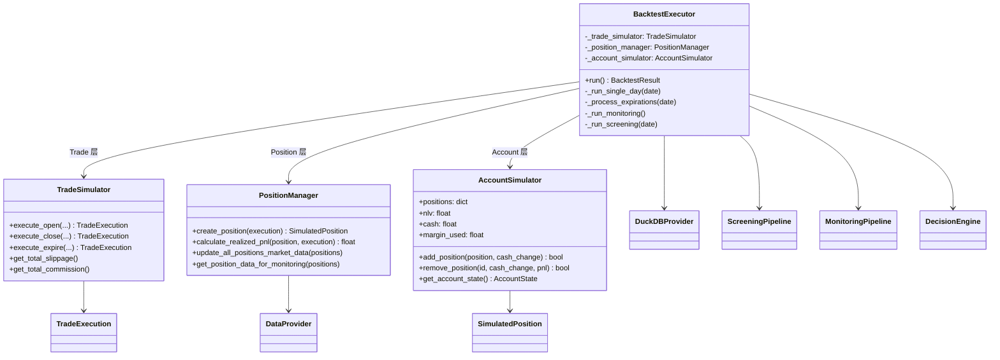
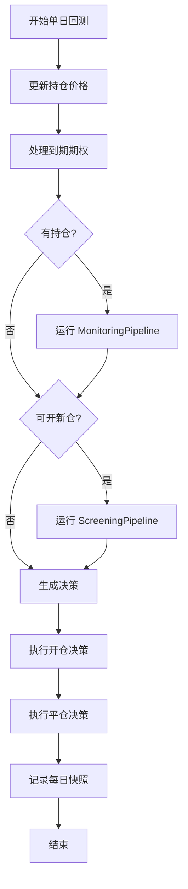
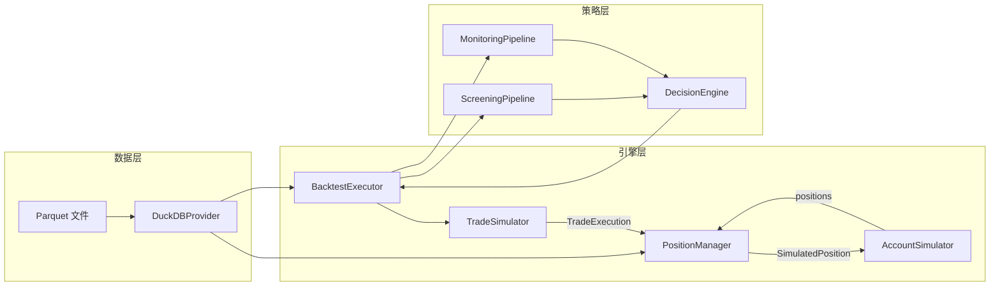

# Backtest 模块用户手册

期权回测模块，支持历史数据获取、Greeks 计算、策略回测。

## 目录

- [快速开始](#快速开始)
- [数据源配置](#数据源配置)
- [为什么自己计算 IV 和 Greeks](#为什么自己计算-iv-和-greeks)
- [模块结构](#模块结构)
- [API 参考](#api-参考)
- [故障排查](#故障排查)

---

## 快速开始

### 1. 启动前置依赖

回测和交易需要以下外部服务：

```bash
# 启动 ThetaData Terminal (期权/股票历史数据)
./scripts/ensure_thetadata.sh

# 启动 IBKR TWS (交易 + 基本面数据)
./scripts/ensure_tws.sh paper   # Paper 账户
./scripts/ensure_tws.sh live    # Live 账户
```

| 服务 | 用途 | 启动脚本 |
|------|------|---------|
| ThetaData Terminal | 期权/股票历史 EOD 数据 | `./scripts/ensure_thetadata.sh` |
| IBKR TWS (IBC) | 交易执行 + 基本面数据 | `./scripts/ensure_tws.sh paper` |

### 2. 验证数据连通性

```bash
# 运行完整验证测试
uv run python tests/verification/verify_backtest_data.py

# 或单独测试各数据源
uv run python tests/verification/verify_backtest_data.py --source thetadata
uv run python tests/verification/verify_backtest_data.py --source yfinance
uv run python tests/verification/verify_backtest_data.py --source ibkr
uv run python tests/verification/verify_backtest_data.py --source greeks
```

### 3. 基本使用

```python
from datetime import date
from src.backtest.data import (
    ThetaDataClient,
    GreeksCalculator,
    DuckDBProvider,
)

# 获取期权数据
client = ThetaDataClient()
options = client.get_option_eod("GOOG", date(2024, 1, 1), date(2024, 1, 31))

# 计算 Greeks
calc = GreeksCalculator()
stock_prices = {d.date: d.close for d in client.get_stock_eod("GOOG", ...)}
enriched = calc.enrich_options_batch(options, stock_prices, rate=0.045)

# 使用 DuckDB 提供者 (支持自动下载)
provider = DuckDBProvider(data_dir="data/backtest")
fundamentals = provider.get_fundamental("GOOG", as_of_date=date(2024, 6, 1))
```

---

## 数据源配置

### ThetaData Terminal

ThetaData 提供期权和股票的历史 EOD 数据。

#### 安装要求

| 依赖 | 版本 | 安装方式 |
|------|------|---------|
| Java | 21+ | `brew install openjdk@21` |
| ThetaData Terminal | v3 | [下载](https://www.thetadata.net/terminal) |
| ThetaData 账号 | FREE 可用 | [注册](https://www.thetadata.net) |

#### 目录结构

```
~/ThetaTerminal/
├── ThetaTerminalv3.jar    # 主程序 (从官网下载)
├── creds.txt              # 账号密码 (email\npassword)
├── config.toml            # 配置文件 (可选)
└── terminal.log           # 运行日志
```

#### 启动脚本

```bash
# 自动启动 (推荐)
./scripts/ensure_thetadata.sh

# 检查状态
./scripts/ensure_thetadata.sh --check

# 停止
./scripts/ensure_thetadata.sh --stop

# 重启
./scripts/ensure_thetadata.sh --restart
```

#### 手动启动

```bash
cd ~/ThetaTerminal
/opt/homebrew/opt/openjdk@21/bin/java -Xms2G -Xmx4G \
    -jar ThetaTerminalv3.jar --creds-file=creds.txt
```

#### 验证运行

```bash
# 检查端口
curl http://127.0.0.1:25503/v3/stock/list/symbols?format=json | head

# 应返回 JSON 格式的股票列表
```

### IBKR TWS + IBC

IBKR TWS 提供交易执行和基本面数据 (EPS, Revenue, Dividends)。
使用 IBC (Interactive Brokers Controller) 实现自动登录和账户切换。

#### 安装要求

| 依赖 | 说明 | 安装方式 |
|------|------|---------|
| TWS | 交易终端 | [下载](https://www.interactivebrokers.com/en/trading/tws.php) |
| IBC | 自动化控制器 | [下载](https://github.com/IbcAlpha/IBC) |

#### 目录结构

```
~/IBC/
├── resources/              # IBC 主程序
│   └── scripts/
├── config.ini              # Paper 账户配置
├── config-live.ini         # Live 账户配置
└── logs/                   # 运行日志

~/Applications/
└── Trader Workstation/     # TWS 安装目录
```

#### 启动脚本

```bash
# 自动启动 (如果未运行或账户不匹配则启动/切换)
./scripts/ensure_tws.sh paper    # Paper 账户 (端口 7497)
./scripts/ensure_tws.sh live     # Live 账户 (端口 7496)

# 仅启动 (不检查)
./scripts/start_tws.sh paper
./scripts/start_tws.sh live
```

#### 端口配置

| 账户类型 | 端口 | 环境变量 |
|---------|------|---------|
| Paper | 7497 | `IBKR_PORT=7497` |
| Live | 7496 | `IBKR_PORT=7496` |
| Gateway Paper | 4002 | `IBKR_PORT=4002` |
| Gateway Live | 4001 | `IBKR_PORT=4001` |

#### TWS API 设置

1. 打开 TWS: `Edit > Global Configuration > API > Settings`
2. 勾选 `Enable ActiveX and Socket Clients`
3. 确认端口号
4. 添加 `127.0.0.1` 到 Trusted IPs

#### IBC 配置文件示例

```ini
# ~/IBC/config.ini (Paper 账户)
IbLoginId=your_username
IbPassword=your_password
TradingMode=paper
AcceptIncomingConnectionAction=accept
```

### yfinance

yfinance 提供宏观指标数据，无需额外配置。

```python
# 支持的指标
^VIX  # 波动率指数
^TNX  # 10年期国债收益率
SPY   # 市场基准
```

---

## 为什么自己计算 IV 和 Greeks

### ThetaData 订阅层级

| 功能 | FREE | VALUE ($40) | STANDARD ($80) | PRO ($160) |
|------|------|-------------|----------------|------------|
| Stock EOD | ✅ | ✅ | ✅ | ✅ |
| Option EOD (OHLC/bid/ask) | ✅ | ✅ | ✅ | ✅ |
| **Implied Volatility** | ❌ | ❌ | ✅ | ✅ |
| **Greeks (1st order)** | ❌ | ❌ | ✅ | ✅ |
| Greeks (2nd/3rd order) | ❌ | ❌ | ❌ | ✅ |
| 1分钟K线 | ❌ | ❌ | ✅ | ✅ |
| 实时流数据 | ❌ | ❌ | ✅ | ✅ |

**问题**：IV 和 Greeks 需要 STANDARD 订阅 ($80/月)

### 解决方案：自行计算

FREE 账户可获取：
- Option EOD: bid, ask, close (期权价格)
- Stock EOD: close (标的价格)
- 期权合约信息: strike, expiration

从这些数据可以**反推计算** IV 和 Greeks：

```
┌─────────────────────────────────────────────────────────────┐
│  Black-Scholes 模型                                          │
├─────────────────────────────────────────────────────────────┤
│  已知: option_price, spot, strike, tte, rate                 │
│  求解: IV (使得 BS_price(IV) = market_price)                  │
│                                                              │
│  IV 求得后，计算 Greeks:                                      │
│    Delta = ∂V/∂S                                             │
│    Gamma = ∂²V/∂S²                                           │
│    Theta = ∂V/∂t                                             │
│    Vega  = ∂V/∂σ                                             │
│    Rho   = ∂V/∂r                                             │
└─────────────────────────────────────────────────────────────┘
```

### 计算精度验证

| 指标 | 自行计算 | 说明 |
|------|---------|------|
| IV | ✅ 精确 | Brent 方法求解，误差 < 0.0001% |
| Delta | ✅ 精确 | 解析解，无近似 |
| Gamma | ✅ 精确 | 解析解，无近似 |
| Theta | ✅ 精确 | 解析解，已转换为每日值 |
| Vega | ✅ 精确 | 解析解，已转换为每 1% IV |

### 成本对比

| 方案 | 月成本 | 数据完整性 |
|------|--------|-----------|
| ThetaData STANDARD | $80/月 | IV + Greeks 直接获取 |
| **FREE + 自行计算** | **$0/月** | **IV + Greeks 计算获取** ✅ |

### 代码示例

```python
from src.backtest.data import GreeksCalculator, ThetaDataClient

# 初始化
client = ThetaDataClient()
calc = GreeksCalculator()

# 获取 EOD 数据 (FREE)
options = client.get_option_eod("GOOG", start, end, expiration=exp)
stocks = client.get_stock_eod("GOOG", start, end)

# 计算 Greeks
stock_prices = {d.date: d.close for d in stocks}
enriched = calc.enrich_options_batch(options, stock_prices, rate=0.045)

# 结果包含完整 Greeks
for opt in enriched:
    print(f"{opt.right} K={opt.strike}: IV={opt.iv:.1%}, Δ={opt.delta:.3f}")
```

---

## 模块结构

```
option_quant_trade_system/
├── scripts/
│   ├── ensure_thetadata.sh      # ThetaData Terminal 自动启动
│   ├── ensure_tws.sh            # IBKR TWS 自动启动 (账户切换)
│   ├── start_tws.sh             # TWS 启动脚本 (IBC)
│   └── run_with_env.sh          # Crontab 环境包装
│
├── src/backtest/
│   ├── data/
│   │   ├── thetadata_client.py      # ThetaData REST API 客户端
│   │   ├── greeks_calculator.py     # IV + Greeks 计算器 (Black-Scholes)
│   │   ├── duckdb_provider.py       # 数据提供者 (Parquet + DuckDB)
│   │   ├── data_downloader.py       # 期权/股票数据下载器
│   │   ├── macro_downloader.py      # 宏观数据下载器 (yfinance)
│   │   ├── ibkr_fundamental_downloader.py  # IBKR 基本面下载器
│   │   └── schema.py                # 数据 Schema 定义
│   │
│   ├── engine/
│   │   ├── backtest_executor.py     # 回测执行器 (协调三层组件)
│   │   ├── position_manager.py      # 持仓管理器 (Position 层)
│   │   ├── account_simulator.py     # 账户模拟器 (Account 层)
│   │   └── trade_simulator.py       # 交易模拟器 (Trade 层)
│   │
│   ├── analysis/
│   │   └── metrics.py               # 绩效指标计算
│   │
│   ├── visualization/
│   │   └── dashboard.py             # 可视化仪表盘
│   │
│   └── README.md                    # 本文档
│
└── tests/verification/
    └── verify_backtest_data.py      # 数据连通性验证
```

---

## 回测引擎架构

### 三层组件架构

回测引擎采用扁平化的三层架构，`BacktestExecutor` 作为协调者直接访问所有组件：

```
┌─────────────────────────────────────────────────────────────────────┐
│ BacktestExecutor (协调者)                                            │
│ - 协调三层组件                                                       │
│ - 控制回测流程                                                       │
│ - 可以直接访问任意组件                                                │
└─────────────────────────────────────────────────────────────────────┘
        ↓                    ↓                    ↓
┌─────────────┐    ┌─────────────────┐    ┌─────────────────┐
│ Trade 层    │    │ Position 层     │    │ Account 层      │
│ TradeSimu-  │    │ PositionManager │    │ AccountSimulator│
│ lator       │    │                 │    │                 │
│             │    │ - 创建持仓      │    │ - 现金管理      │
│ - 滑点计算  │    │ - 计算 margin   │    │ - 保证金检查    │
│ - 手续费    │    │ - 计算 PnL      │    │ - 持仓存储      │
│ - 交易记录  │    │ - 市场数据更新  │    │ - 权益快照      │
└─────────────┘    └─────────────────┘    └─────────────────┘
```

### 核心组件

| 组件 | 层级 | 职责 |
|------|------|------|
| `BacktestExecutor` | 协调者 | 回测执行器，协调整体流程，逐日迭代交易日 |
| `TradeSimulator` | Trade 层 | 交易模拟器，计算滑点和手续费，生成 TradeExecution |
| `PositionManager` | Position 层 | 持仓管理器，创建持仓、计算 margin/PnL、更新市场数据 |
| `AccountSimulator` | Account 层 | 账户模拟器，管理现金、检查保证金、存储持仓 |

### 关键数据结构

| 数据结构 | 说明 |
|---------|------|
| `SimulatedPosition` | 单个期权持仓 (含市值、保证金、未实现盈亏) |
| `EquitySnapshot` | 每日权益快照 (现金、持仓价值、NLV) |
| `DailySnapshot` | 每日回测快照 (含当日开/平仓数量) |
| `TradeExecution` | 交易执行记录 (含滑点、手续费) |
| `TradeRecord` | 交易历史记录 (含盈亏) |
| `BacktestResult` | 最终回测结果 (收益率、胜率、Profit Factor) |

### 类关系图



### 每日执行流程



### 数据流



### 交易执行流程

开仓操作的三层协作：

```
1. Trade 层 (TradeSimulator)
   └─ execute_open() → TradeExecution (含 fill_price, commission, net_amount)

2. Position 层 (PositionManager)
   └─ create_position(execution) → SimulatedPosition (含 margin, market_value)

3. Account 层 (AccountSimulator)
   └─ add_position(position, cash_change) → 检查保证金，更新现金，存储持仓
```

平仓操作的三层协作：

```
1. Trade 层 (TradeSimulator)
   └─ execute_close() → TradeExecution (含 fill_price, commission, net_amount)

2. Position 层 (PositionManager)
   └─ calculate_realized_pnl(position, execution) → realized_pnl

3. Account 层 (AccountSimulator)
   └─ remove_position(id, cash_change, pnl) → 更新现金，移动到 closed_positions
```

### 使用示例

```python
from src.backtest import BacktestConfig
from src.backtest.engine import BacktestExecutor

# 加载配置
config = BacktestConfig.from_yaml("config/backtest/short_put.yaml")

# 创建执行器
executor = BacktestExecutor(config)

# 运行回测
result = executor.run()

# 分析结果
print(f"Total Return: {result.total_return_pct:.2%}")
print(f"Win Rate: {result.win_rate:.1%}")
print(f"Profit Factor: {result.profit_factor:.2f}")
print(f"Trading Days: {result.trading_days}")
print(f"Total Trades: {result.total_trades}")

# 获取每日权益曲线
equity_curve = executor.get_equity_curve()
for date, nlv in equity_curve[-5:]:  # 最后 5 天
    print(f"{date}: ${nlv:,.2f}")

# 获取回撤曲线
drawdowns = executor.get_drawdown_curve()
max_drawdown = max(dd for _, dd in drawdowns)
print(f"Max Drawdown: {max_drawdown:.2%}")
```

### 保证金计算 (Reg T)

账户模拟器使用 Regulation T 保证金公式：

**Short Put:**
```
Margin = max(
    20% × Underlying Price - OTM Amount + Premium,
    10% × Strike + Premium
)
```

**Short Call:**
```
Margin = max(
    20% × Underlying Price + OTM Amount + Premium,
    10% × Underlying Price + Premium
)
```

### 滑点模型

交易模拟器支持价格分层滑点：

| 期权价格 | 滑点百分比 |
|---------|-----------|
| < $0.50 | 5% (低价期权 bid-ask spread 大) |
| $0.50 - $5.00 | 0.1% (正常滑点) |
| > $5.00 | 0.2% (高价期权) |

---

## API 参考

### ThetaDataClient

```python
from src.backtest.data import ThetaDataClient, ThetaDataConfig

# 配置
config = ThetaDataConfig(
    host="127.0.0.1",
    port=25503,
    rate_limit_requests=20,  # FREE tier: 20 req/min
)

client = ThetaDataClient(config)

# 股票 EOD
stocks = client.get_stock_eod("AAPL", start_date, end_date)

# 期权到期日
expirations = client.get_option_expirations("AAPL")

# 期权 EOD
options = client.get_option_eod(
    "AAPL",
    start_date,
    end_date,
    expiration=date(2024, 3, 15),  # 可选
    max_dte=45,  # 可选
)
```

### GreeksCalculator

```python
from src.backtest.data import GreeksCalculator

calc = GreeksCalculator(dividend_yield=0.0)

# 单个期权
result = calc.calculate(
    option_price=5.50,
    spot=100.0,
    strike=105.0,
    tte=30/365,  # 年化
    rate=0.045,
    is_call=True,
)
print(f"IV={result.iv:.1%}, Delta={result.delta:.3f}")

# 批量计算
enriched = calc.enrich_options_batch(
    options,           # OptionEOD 列表
    stock_prices,      # {date: price} 字典
    rate=0.045,
)
```

### DuckDBProvider

```python
from src.backtest.data import DuckDBProvider

provider = DuckDBProvider(
    data_dir="data/backtest",
    auto_download_fundamental=True,  # 自动下载基本面
    ibkr_port=7497,
)

# 获取基本面数据 (Point-in-Time)
fundamentals = provider.get_fundamental("GOOG", as_of_date=date(2024, 6, 1))
print(f"TTM EPS: {fundamentals['ttm_eps']}")
```

---

## 故障排查

### ThetaData Terminal 无法启动

```bash
# 检查 Java 版本
java -version  # 需要 21+

# 检查端口占用
lsof -i:25503

# 查看日志
tail -f ~/ThetaTerminal/terminal.log
```

### 常见错误

| 错误 | 原因 | 解决方案 |
|------|------|---------|
| `Address already in use` (25503) | ThetaData 端口被占用 | `./scripts/ensure_thetadata.sh --restart` |
| `Invalid session ID` | ThetaData 会话过期 | 重启 Terminal |
| `403 Forbidden` | ThetaData 需要付费订阅 | 使用 GreeksCalculator 自行计算 |
| `Connection refused` (25503) | ThetaData Terminal 未运行 | `./scripts/ensure_thetadata.sh` |
| `class version 65.0` | Java 版本过低 | 安装 Java 21+ |
| `TWS/IBC already running` | TWS 实例已存在 | `./scripts/ensure_tws.sh paper` |
| `Connection refused` (7497) | TWS 未运行 | `./scripts/ensure_tws.sh paper` |
| `Not connected` | TWS API 未启用 | TWS 设置中启用 API |

### IBKR TWS 无法启动

```bash
# 检查 TWS/IBC 是否运行
pgrep -f "java.*IBC"

# 查看 IBC 日志
tail -f ~/IBC/logs/*.txt

# 手动启动
./scripts/start_tws.sh paper
```

### IBKR 连接失败

```bash
# 检查端口
lsof -i:7497

# 确认 API 设置
# TWS > Edit > Global Configuration > API > Settings
# - Enable ActiveX and Socket Clients: ✅
# - Socket port: 7497
# - Trusted IPs: 127.0.0.1
```

### TWS 账户切换

```bash
# 自动检测并切换账户
./scripts/ensure_tws.sh paper   # 切换到 Paper
./scripts/ensure_tws.sh live    # 切换到 Live

# 脚本会自动:
# 1. 检测当前运行的账户类型
# 2. 如果不匹配，停止当前 TWS
# 3. 启动新的 TWS 实例
```

### yfinance 超时

```bash
# 可能是代理问题
unset http_proxy https_proxy

# 或设置正确的代理
export HTTP_PROXY="http://127.0.0.1:33210"
```

---

## 附录

### 环境变量

| 变量 | 默认值 | 说明 |
|------|--------|------|
| `THETADATA_HOME` | `~/ThetaTerminal` | Terminal 安装目录 |
| `THETADATA_PORT` | `25503` | Terminal 端口 |
| `IBKR_PORT` | `7497` | TWS/Gateway 端口 |

### 依赖版本

```toml
# pyproject.toml
dependencies = [
    "thetadata==0.9.11",  # ThetaData Python client (可选)
    "duckdb>=1.0.0",      # 本地数据库
    "pyarrow>=15.0.0",    # Parquet 支持
    "yfinance>=0.2.28",   # 宏观数据
    "ib_async>=2.0.0",    # IBKR API
    "scipy>=1.10.0",      # Greeks 计算
    "plotly>=5.0.0",      # 可视化
]
```
