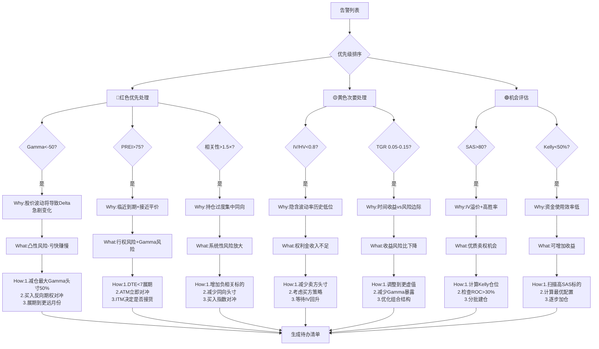
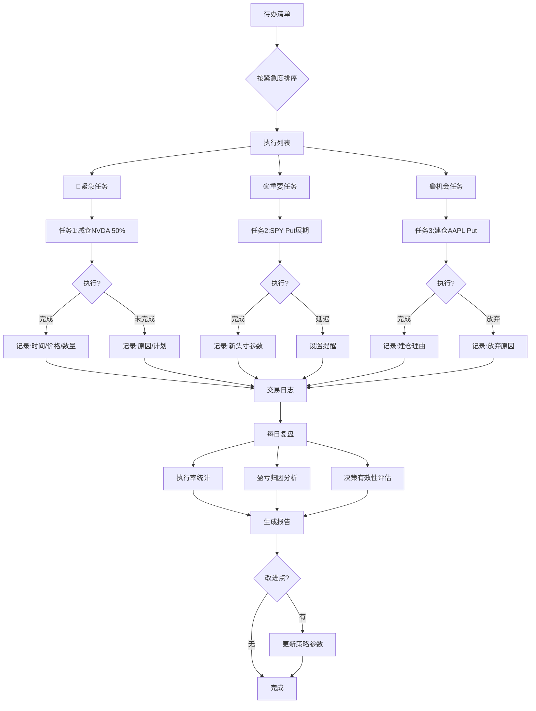

# 期权量化交易理论探究-以卖看跌期权为例


## 股票波动率

### **HV(历史波动率)：**

**物理含义：**波动率表示股票收益率的标准差。IV(隐藏波动率)是对于未来预期的标准差，HV（历史波动率）是对于过去统计的标准差。

**数学计算：**X天的历史波动率=  X天内每天的对数收益的标准差。使用对数是因为它的统计性质，可以直接相加且更符合正态分布。

- 示例： 第一天：股价从100→102，对数收益率=ln(102/100)= 0.0198=1.98%。
    
    第二天：股价从102→99, 对数收益率=ln(99/102) =-2.96%
    
    … 继续计算30天。
    
    然后计算这30个收益率的标准差，假设得到日波动率为1.5%，最终转化成年化波动率需要乘以根号252(一年约252个交易日)， HV = 1.5* sqrt(252) = 23.8%。 它表明大约有68%的概率（正态分布一个标准差内概率），在一年内的股价波动不超过|23.8%|， 它量化了股价过去的“跳跃程度”。
    

### **IV(隐藏波动率)：**

**物理含义：**波动率表示股票收益率的标准差。IV(隐藏波动率)是反映市场对于未来预期的股价波动率。

**数学计算：**IV不是直接计算的而是基于市场价格**“反推”**的。具体的逻辑是：既然采用Black-Scholes公式（**具体公式见引申阅读中的—期权理论定价模型**），可以计算理论期权价格，其中一项输入参数是波动率。那么现实中我们有市场定价的期权价格，什么样的波动率能让BS公式下的理论期权价格==市场期权价格呢？这个反推出来的波动率就是IV。

- 示例： 假设腾讯现价590，一个月后到期的行权价600的Call期权，市场价格是15元。我们知道BS公式中所有其他参数（S=590, K=600, T=1/12, r=3%），唯一不知道的是σ。
    
    我们可以尝试不同的σ值：
    
    - 如果σ=20%，BS算出期权价值=12元（太低了）
    - 如果σ=30%，BS算出期权价值=18元（太高了）
    - 如果σ=25%，BS算出期权价值=15元（正好！）
    
    这个25%就是IV。 它代表市场参与者对于未来一个月对于股价波动程度的集体预期。
    

### **IV/HV**

期权交易的本质，是买方通过对不确定性出价，买一份保单， 把责任转嫁给买方，自己保留理赔的权利， 期权价格就是保费。IV偏高就像人们普遍认为未来出险的概率高，愿意提高保费买保险， 反之IV偏低就说明市场普遍认为未来会比较安全平稳，只愿意低价续保。

举个例子，2020年3月COVID爆发时，标普500的HV约30%（基于过去一个月的数据），但IV飙升到80%！市场在定价时假设未来的不确定性是过去的2.6倍。如果你当时判断恐慌过度，卖出期权，随着IV在接下来几个月回落到30%，你会获得巨大利润。

IV/HV的意义：**1.择时**。 **“均值回归”—长期看IV会趋向于HV。** 如果IV显著高于HV，说明现在市场给了个比较高的价格，可能是一个卖出期权的好时机；反之如果IV显著低于HV，可能现在不是卖出期权的好时机， 而是做买方策略的好时机。 **2. 披露市场风向。** 如果IV突然升高， 一般有两种情况：市场真的预见了即将发生的大事件 or市场陷入了过度恐慌。  此时，需要进一步调查市场在担忧什么风险？ 以及评估担忧的合理性？  从而进一步决定是否要参与交易，而不是仅仅依靠期权价格决策。

## **胜率(盈利概率)**

在券商软件上，会显示期权交易的“盈利”概率， **所谓胜率，就是不被行权的概率**(对于卖方而言(纯赚权利金)； 对于**买方而言就是1-卖方胜率**(期权是零和博弈(不算交易佣金折损的话)))。 那它是怎么估算的呢？ 它和真实盈利概率的偏差如何？

- 用1-｜Delta｜近似估算的原理（卖put）
    - 这是常用的一种近似估算方法。 原因是在B-S公式中， Delta = N(d1) - 1，d1 - d2 = σ√T， 1- |Delta| = 1 - (1- N(d1)  = N(d1)。  由N(-d2)的含义：期权被行权的真实概率， 胜率=1-N(-d2) = N(d2)（正态分布的累积概率密度分布函数CDF特性）。当波动率较小且到期日较近时，σ√T接近0 (比如波动率25%，30天到期，σ√T = 0.25×√(30/365) = 0.072），此时d1~=d2, N(d1)~=N(d2)。即1-|Delta| ~= 胜率(卖方)
    - 分析：可以发现这种估算方法误差总是存在的，当σ、√T较小时误差才小。 且N(d1) > N（d2) 总是成立,  所以Delta法估算的胜率总是偏高一点的（卖put）。
- 用IV准确计算的原理
    - 由于期权定价模型B-S，基于理论期权价格反推出市场IV，假设股价服从对数正态分布，已知，对于卖put，**胜率=1-N(-d2) = N(d2)**。 其中**d2 = [ln(S/K) + (r - IV²/2)×T] / (IV×√T)**。其中S、K、r、T都是已知变量，IV已经反推出来, 所以胜率可以求得。
- 用Black-Scholes模型估计胜率的偏差
    - 实际上基于B-S模型的胜率，**与真实胜率会有一些偏差**。
    - 原因是B-S模型有一些较强的，不符合实际情况的假设：
    1.  **“瘦尾”假设 vs. “肥尾”现实**：模型假设**股价对数服从正态分布**，这意味着极端事件（如-80%的崩盘或+100%的暴涨，即“尾部事件”）发生的概率微乎其微。然而，现实是“黑天鹅”事件（肥尾现象）发生的频率远高于模型预测。  后果：总是要考虑小概率黑天鹅事件对胜率的影响。
    2.  **IV恒定不变的假设**：模型**假设在期权有效期内IV是固定**的。但现实中，IV本身波动剧烈。最典型的就是财报前IV飙升，财报后IV骤降（IV Crush）。 后果：这对卖方有时是好事。你可以在高IV时卖出，财报后即使股价对你不利，IV的暴跌也能让你的期权价值下降从而盈利。这是简单胜率模型无法捕捉的“隐藏利润来源”。
    3.  **随机游走假设**：模型**假设股价变动是完全随机、无记忆的**。但现实中存在趋势、动量、均值回归等模式。  后果： 要考虑股价趋势/动量，对于正态分布数学期望移动的影响，并进行响应的胜率修正。
- 用ML方法估算胜率的可行性与难点。
    
    既然，基于传统的B-S模型，可能引入各种偏差。那使用ML模型是不是更好呢？
    
    理论上基于ML深度学习模型，可以捕捉非线性关系和复杂模式，而非强假设的正态分布概率模型。 一些量化基金的研究显示，精心训练的ML模型可以将胜率预测的准确性提高3-5个百分点。这看起来不多，但在期权交易这样的负和游戏中（考虑交易成本），这样的优势可能意味着年化收益率从5%提升到15%。
    
    但是ML方法会有一些问题：1. 过拟合风险，金融市场的规律其实是动态变化的，基于历史数据的pattern也许在未来某天就失效了，例如COVID-19刚出现那段时间，量化模型大量抛售，导致股指连续熔断，就是因为对于黑天鹅事件历史数据中难以学习到。  2.  信息脆弱性。  另外由于期权市场本身零和博弈的特性，对手策略的改变，也会导致模型的失效，这也是为什么量化基金都不会公开自己的策略和模型，因为知道的人越多越失去效果。 此外在落地门槛上， 需要高时效性、数据量大、干净的数据集， 以及丰富的算力支持， 只有大型机构才能够玩得起。
    
    对于个人玩家，传统模型方法应该够用了，如果不追求那额外几个点的准确率优势的话。
    
     
    

## **收益率**

这个就比较直观了， 年化回报率 = (权利金 / (行权价 * 100)) * (365 / 剩余到期天数)。

## **期望收益-如何衡量潜在损益**。

收益率并不能反映真实的期望收益，因为没有计算行权导致的潜在损失。

**期望收益（卖方） = (1-行权概率) * 权利金 +  行权概率 * 行权后的期望损益**

由**Black-Schole模型**，已知**行权概率 = N(-d2).**

因为只要不行权(S(股价) > K（行权价）)，权利金就是固定的(C)。 

比较难算的是行权条件下的期权损益，它需要计算（S < K）时，每一个股价的概率，和对应的损益（C > K-S时是收益， C < K-S时是损失）。

如何计算？两种方法： 法1：借助B-S模型及其假设计算解析解。 法2: 蒙特卡洛模拟法，以大数定理估算真实概率。

先说法1结论： **行权后的期望股价 =** **e^(rT) × S×N(-d1) / N(-d2) ； 行权后的期望损益= C - [K -**   **e^(rT) × S×N(-d1) / N(-d2) ] 。 推导过程见** 

[行权条件下期望股价推导](https://www.notion.so/2624eb83e71a80628620ec16566c8b4d?pvs=21)

用E[π]表示期望收益**，** 

**则** **E[π]  = C * (1-N(-d2)) + N(-d2) * [C - (K - e^rT* S * N(-d1)/ N(-d2)] 
=  C -N(-d2) *  [K -  e^(rT) * S * N(-d1) / N(-d2)]** 

示例：现股价S为600，行权价K为550， 权利金C为6.5，N(-d1)= 11%, N(-d2)=10%,  行权后的期望股价= 531， 行权后的期望损益=-12,  期望收益=4.4。

## **收益标准差-理解收益的波动性**

期望收益能高速我们平静能赚多少钱，但是无法告知风险有多大。举个简单的例子，投资A：有50%的概率赚十元，50%的概率赚0元，期望收益5元。投资B：50%概率赚100元，50%概率亏90元， 期望收益5元。那么显然投资B风险更大。需要收益标准差来揭露这种波动性风险，毕竟没有多少人能承受股价坐过山车。

**期望收益标准差 = sqrt (每个股价的概率 * （该股价下的损益 - 期望收益）^2)** 

公式如下：

 **Var[π] = E[π²] - (E[π])²
 = [C²  × （1-N(-d2)] + [(C-K)² × N(-d2)  + 2(C-K) ×  e^(rT) × S×N(-d1) + S^2 × exp(2rT + σ²T) × N(-d3)]  
 - {C -N(-d2) *  [K -  e^(rT) * S * N(-d1) / N(-d2)] }^2;**

 **Std[π] = sqrt(Var[π])   ;**

其中d3是自定义新变量： **d3 = (ln(S/K) + (r + 3σ²/2)T) / (σ√T) ;**

整个推导和证明过程见：

[期望收益波动率的推导](https://www.notion.so/2624eb83e71a80f9b592f8a03b5759d2?pvs=21)

## **夏普比率-衡量投资性价比**

**物理含义：** 

**收益风险比 = 期望收益 /  期望收益标准差**。

**夏普比率 =  超额收益 / 期望收益标准差 = (期望收益  - 无风险收益) /  期望收益标准差**

**数学形式 :**

**SR(Sharpe Ratio) = (E[π] - Rf) / Std[π]**

**Rf(无风险收益) = m × K × (e^(rT) - 1) ≈ m × K × r × T**。 其中r是无风险收益率， K是行权保证金，m是保证金比例。 无风险收益衡量的是为了保证行权而不能动的那笔钱的无风险利息。

因此 **SR = [E[π] - m* K × (e^(rT) - 1)] / Std[π],  年化SR = SR × sqrt(365/天数) = SR / sqrt(T)**

夏普比率是1966年由诺贝尔奖得主威廉·夏普提出，用来衡量投资的“性价比”。一般来说，夏普比率大于1被认为是好的，大于2是很好的，大于3是极好的。

## **Kelly公式-如何确定合理仓位**

背景：Kelly准则最初是贝尔实验室的科学家John Kelly在1956年提出的，用于解决信息传输中的最优投注问题。它回答的核心问题是：当你有一个正期望值的机会时，应该投入多少资金才能最大化长期财富增长？ 在卖put场景，则帮助回答：**给定期权的胜率和赔率，我应该用多少比例的资金来卖出这份“保单”？**

**数学形式**：f_kelly =  μ / σ² 

f_kelly代表该策略下的资金最优仓位。  μ (mu): 代表策略的期望收益。这正是我们之前计算的 E[π]！它代表了你在这场博弈中的“优势”（edge）。 σ² (sigma squared):  代表策略收益的方差, 即我们之前计算的Var[π]。

**基本思想：** Kelly公式的目标是寻找**长期财富对数增长率最大。** 关键一是**长期**而非短期 所以追求财富几何增长率最大而不是单次算数增长率最大，关键二是**对数，**因为对数在数学特性上在越接近0是斜率越大，所以天然包含了对于风险控制的偏好。

**简单推导过程：**

```markdown
假设你有初始资本W₀，每次投注比例为f（0 ≤ f ≤ 1），每次收益率为π。经过n次投注后，你的财富变成：
W_n = W₀ × ∏(1 + f × π_i)

取对数得到累积增长率：
ln(W_n/W₀) = Σln(1 + f × π_i)

Kelly的核心是：要最大化长期对数增长率的期望，即：
max E[ln(1 + f × π)]
为了求最优的f，我们对f求导并令其为0。使用泰勒展开ln(1 + x) ≈ x - x²/2（当x较小时）：
E[ln(1 + f × π)] ≈ E[f × π - (f × π)²/2]
= f × E[π] - f²/2 × E[π²]
= f × μ - f²/2 × (σ² + μ²)

对f求导：
d/df = μ - f × (σ² + μ²) = 0
解得：f* = μ/(σ² + μ²)
当μ相对于σ较小时，μ² << σ²，因此近似得到：
f ≈ μ/σ²*

```

# 如何借助量化模型，构建自己的期权交易系统

我想构建自己的期权交易决策系统（先仅限卖put交易）。我的想法是： **包括开仓前的筛选系统， 持仓时的管理系统， 月度/季度复盘系统**。

## 开仓前的筛选系统

开仓前的选择应该是一个多层漏斗， 首先有个自己比较了解的、长期看多的股票候选池。

### 第一层：市场过滤器 — 判断当前的市场情绪和宏观经济。

 **采用指标**： VIX指数、SPY指数趋势、VIX期限结构、Put/Call Ratio（看跌期权成交量/看涨期权成交量）。

- 首先想清楚“理想的”市场环境是什么样？ 对于卖put期权来说，实际上是做三件事：**受保护费、承担下行风险、赌时间站在我这边。** 那如果我是保险公司，什么时候卖保险最好？ — 当**保费很高但理赔概率很低的时候**。
- 采用什么指标？
    - **VIX指数**：又被称为“恐慌指数”，衡量的是S&P500指数未来30天的IV(隐含波动率)，可以理解为市场反映的对未来不确定性的定价。 为什么对卖Put重要？ 当VIX升高，说明未来的不确定性预期加大，此时期权价格会上涨（因为卖方承担的不确定性风险增大）。但是，也要警惕VIX太高，可能预示着未来市场真有大跌；VIX太低则意味着权利金太少，不值得承担风险。因此VIX在一定的范围，例如15~25之间，或者过去一年的50%～80%百分位时，对于卖PUT是好市场。
    - **S&P500 ETF趋势**： S&P500可以认为代表了美股大盘**，**上行趋势对于卖put更有优势，行权概率会更小。因此可以观察：20日均线（短期趋势）、50日均线（中期趋势）、200日均线（长期趋势）。当这三条线呈多头排列（20日>50日>200日）且向上倾斜时，市场对卖put有利。 反之如果出现死叉或者下行趋势，则需要谨慎开仓。
    - **VIX期限结构**：时间的形状。 正常的情况下，远期VIX应该高于近期VIX（这叫正向结构），因为未来的不确定性更大。当VIX期限正向结构时，对卖Put更好，因为这说明，第一近期没有潜在的“黑天鹅”事件，导致卖方承担下行亏损； 第二随着时间推移，远期波动率会向近期收敛，这种“均值回归”特性使得时间更多的站在卖方这边。可以通过比较VIX（30天）与VIX3M（3个月）的比值来量化这个指标。比值小于0.9表示正常的正向结构，0.9-1.0需要谨慎，超过1.0则建议暂停新开仓。
    - **Put/Call Ratio**：市场情绪的天平。 当PCR很高时，说明市场可能过度悲观，大量资金在买put保护或者做空，此时往往对应市场底部，此时Put期权因需求旺盛而价格虚高，同时市场情绪物极必反的概率较大，因此对应卖Put的好时机。
    - 注意事项：（1） 单一指标片面，需要多个角度验证。 (2) 指标都有滞后性，需要自行结合价格和其他先行指标判断。（3） 特殊事件期要额外小心：美联储议息会议、重要经济数据发布、财报季等。

### 第二层： 标的过滤器 — 即使交易期权，也要选择真心愿意长期持有的公司

卖Put本质上是在说："我愿意在某个价格买入这只股票，同时收取一笔保险费。"这意味着您需要选择那些您真心愿意持有的公司，而不是纯粹为了权利金去碰您不了解或不看好的股票。

**如何衡量一家公司的好坏、以及是否合适交易期权。**

- 基本面分析：
    - 技术面分析，个人觉得是最难的，一千个人眼中有一千个哈姆雷特，要真的看懂一家公司并不容易。这里不做深入的探讨，因为很难，也没有标准统一的分析方法论。只列出一些常见的财务指标。 这些财务指标要结合行业特点、经济周期、公司阶段很复杂的维度来看。
    - **PE(市盈率)**:  特别是处于历史的相对位置比绝对数字更重要。当PE处于历史低位（且业绩本身没有受大的冲击），说明市场过度悲观了， 是卖PUT的好时机。
    - **营收增长率**：稳定的营收增长比暴涨暴跌更重要。股价的剧烈波动导致深度套牢的风险更大。 卖put给稳定营收增长的公司就像给作息规律的人卖健康险，给营收波动大的公司就像给极限运动员卖意外险。
    - **利润率**： 利润率，特别是毛利率和营业利润率，反映公司的定价权和运营效率。高且稳定的利润率通常意味着公司有某种护城河——品牌、技术、规模或网络效应。优质的公司应该利润率比行业中位数高且持续高。
    - **分析师评级：**分析师评级是专业投资者对公司前景的判断汇总。虽然分析师经常犯错，但他们的**集体观点仍有参考价值**，特别是评级的变化趋势。对卖Put来说，**最理想的是评级在"持有"到"买入"之间**，且近期有上调趋势。为什么不选择一致"强烈买入"？因为期望值已经打得很满，一旦失望下跌会很剧烈。而"持有"评级的公司，市场期待不高，坏消息可能已经price in，这时卖Put的风险收益比反而更好。
- 技术面分析：
    - 技术面分析，就是基于市场有效性假说（所有的信息已反映在价格中）、价格以趋势的形式发展、历史会重演作为核心假设。
    - RSI（相对强弱指数）：动量指标，衡量价格上涨下跌的动能。 通常认为>70是超买，<30是超卖。实践中“超卖的可以更超卖”，落刀子的时候不知何时见底，所以对于卖put而言，选择健康震荡或温和上涨趋势的股票更合适，即RSI在40-60之间。也可以关注RSI和股价的背离情况，例如股价创新低但RSI没有创新低(正背离)，说明下跌动能减弱，此时卖Put相对安全。
    - Support Distance：安全垫的厚度。衡量当前股价距离关键支撑位的距离，支撑位可以是前期低点、重要均线、成交密集区。对于卖Put而言，行权价通常设在支撑位附近或下方。如果当前价格距离支撑位有10%的空间，您可以安心地在支撑位上方5%卖Put，给自己留出缓冲。如果股价已经贴近支撑位，则需要把行权价设得更低，但这会减少权利金收入。
- 波动率分析：
    - IV Rank：波动率的历史分位。 为什么IV Rank比IV绝对值更重要？因为不同股票的"正常"波动率差异巨大，所以股票比较自己的历史是更明显的信号。 对卖Put来说，IV Rank在50以上才值得考虑，70以上是黄金区域，但超过90要小心，可能的黑天鹅事件。
    - IV/HV比值：期权的性价比。和IV Rank本质很接近，都是衡量近期IV相比历史长期的差异。当IV/HV > 1.2时，说明市场预期未来波动会高于历史，期权溢价较高，适合卖出。当IV/HV < 0.8时，期权相对便宜，不适合卖出。

在实际使用这些指标时，**建议采用"逐层深入"的方法**。**首先用IV Rank**和基本估值快速筛选，找出20-30个候选标的。**然后深入分析技术面**，剔除处于下降趋势或没有明确支撑的股票。最后，对剩余的5-10个标的**做详细的基本面研究**。

### **第三层： 合约过滤器， 选择合适的到期日、行权价、权利金。**

- 过滤顺序： 选择DTE(到期日) → 选择行权价 → 选择期权合约。
- **step1: 选择DTE**：
    - **选择依据：最大化利用Theta(时间价值)、同时规避Gamma风险。**
    - 指标：
        - Theta：（物理含义：单位时间变化对应期权价格变化速度。 数学形式：期权价格对时间求偏导，Theta ∝ 1/√T）
        - Gamma：（物理含义：单位股价变化对应期权变化的加速度（Delta变化的速度）。 数学形式：期权价格对股价的二阶偏导，也是Delta的一阶偏导， Gamma ∝ 1/T）
        - Theta/权利金 ：（物理含义：每天赚取的时间价值，占权利金的百分比。 可以认为是”Theta效率”）
        - 选择逻辑： Theta是期权卖方最好的朋友，卖方就是通过承担风险来赚取每日流失的时间价值。 Gamma是期权卖方最大的敌人，它会导致“赚的慢，亏得快”的不利局面。Theta/权利金使得不同股价/权利金的期权合约之间，在时间效率上可以拉齐量纲对比。
    - 筛选策略： <1>先根据Theta和Gamma与DTE的关系，选择Theta相对高Gamma相对低的DTE区间。<2> 再在备选合约中，选择Theta/权利金相对高的，这样能确保资金的单位效用。

- **step2: 选择行权价：**
    - 在锁定了DTE之后，就要在到期日的期权链上寻找具体的行权价。
    - 选择依据：
        - Delta： Delta越低说明抗股价波动的能力越强，风险越小。
        - 胜率：对于卖Put，胜率约等于 **1 - |Delta| ， （精确值=1-N(-d2) = N(d2)**。 其中**d2 = [ln(S/K) + (r - IV²/2)×T] / (IV×√T)）。**
        - 年化收益率：权利金收益和所需保证金带来的投资收益率，是忽略风险的投资收益上限。可以给一个较高的阈值，例如15%，如果15%都达不到，那就不值得承担任何风险。
        - 年化期望收益率：考虑胜率和期望损失，得到一个理论收益期望值。也可以设定一个阈值，例如不能低于无风险收益率：例如国债利率、高股息ETF股息率。

- **step3： 选择是否开仓以及仓位：**
    - 在锁定了一些行权价对应的期权合约之后，下一步要决定是否交易开仓以及仓位比例。
    - 选择依据：
        - 夏普比率：保证投资性价比。 夏普比率<1直接不考虑，夏普比率<1.5观望， 夏普比率>1.5才考虑开仓。
        - 连续Kelly公式： 保守一点可以根据f_kelly的1/4或者1/2，作为仓位配比。

## 持仓管理系统

监测系统分为三个level，**投资组合、期权合约、资金仓位。**

决策流程也分为三阶段： **识别风险/机会， 下钻分析why&what&how,  制定todolist和优先级。**

### 宏观投资组合监控（Portfolio Level Index）

**总头寸方向性风险-Beta加权Delta总和**

- **Beta加权Delta**：将不同的股票之间的风险统一度量衡。就像是把不同的货币兑换成美元。
- **Beta衡量个股相对于大盘的波动性**。 Beta=1意味着股票与大盘波动同步，Beta=2这以为着波动时大盘的2倍，大盘涨1%，个股涨2%。 **Beta=Covariance(个股收益率，大盘收益率)/ Variance（大盘收益率），其中个股收益率、大盘收益率是每日涨跌幅序列**。许多券商软件上会标识股票的Beta（例如Tencent=0.23， Tesla=2.46）。
- 计算示例：如果大盘收益率追踪的是SPY，那么+752说明， 合约组合相当于买了752股SPY，如果SPY股价是$450，这相当于$338400的敞口，远超账户$100000的规模，这就是期权的杠杆效应，SPY下跌1%，就可能下跌$3384, 占账户的3.38%。
    
    
    
- **Beta加权Delta总和：** 衡量的是大盘指数股价变化对应的期权价格变化。若合理的期权组合是希望保持市场中性，则最好组合Delta总和接近0。

**总头寸时间价值衰减收益-所有持仓Theta之和**

- 含义：衡量时间每过去1天，总头寸的时间价值。

**总头寸波动率风险-所有持仓Vega之和**

- 含义：Vega是期权对IV变动的敏感程度。
- 决策依据：如果总Vega为正，将从IV上升中获利（期权净买方)，如果总Vega为负，将从IV下降中获利（期权净卖方）。 卖方在高IV时卖出(期权价格高)，在IV回落时买回获利，是常见的策略。  卖方更希望看到：总Vega为正，且IV/HV处于高位。 买方更希望看到：总Vega为负，且IV/HV处于低位。

**总头寸加速风险-所有持仓Gamma之和**

- 含义：股价变动$1总持仓的Delta变动情况。
- 决策依据：对于一个较大的Gamma而言，股价一点波动，会导致Delta的较大变化。 例如对于卖put而言，当负gamma，股价下降一点，会导致|Delta|大幅升高，导致期权价升高（浮亏），导致胜率下降（行权概率增大）。

**风险收益比-Portfolio TGR**

- **Portfolio TGR =** PortfolioTheta / |Portfolio Gamma*100|
- 含义：卖方常用，每一个单位的凸性风险（Gamma）中赚取了多少每日利润，比率越高说明承受价格波动的风险时获得的回报越丰厚。

### 个股期权合约监控（Position-Level index）

**行权风险-Delta & Moneyness**

**Moneyness：=(S-K)/K,**  期权的“安全距离”， 对于卖put方，越大于0越安全，越<0越危险。

**亏损加速风险-Gamma**

决策依据： Gamma对于卖方为负，是“敌人”非“朋友”。 当股价朝不利方向变动时，亏损会加速；当朝有利方向变动时，盈利会减速 。这会导致盈利和亏损不对称。

**波动率择时-IV/HV**

决策依据： 高IV时市场恐慌，低IV时市场乐观。恐慌时期权价格高适合卖出乐观时期权价格低适合买入。

**收益效率指标-TGR、ROC**

**TGR**： 每一个单位的凸性风险（Gamma）中赚取了多少每日利润。

**ROC:  (权利金/保证金) * (365/DTE) ，**资金的年化收益率。

**组合指标 -SAS、PREI**

**SAS（策略吸引力分数-Strategy Attractiveness Score）**：衡量卖出期权的性价比，由波动率溢价、 风险收益比(Sharpe Ratio)、 和胜率(不行权概率)组成。

SAS = w1×(IV/HV) + w2×Sharpe Ratio + w3 ×P(win)

 

**PREI(持仓风险暴露指数-Position Risk Exposure Index) ：** 衡量持仓的收益不稳定性， 由亏损加速风险、 波动率敞口、 临期风险组成。

PREI = w1 * Normalized |Gamma| + w2 * Normalized |Vega| + w3 * (1/DTE)^0.5

### 资金仓位监控（Capital-Level Index）

**性价比—夏普比率Sharpe Ratio：衡量每承担一单位的风险，带来的超额回报多少。**>1才认为是划算的。

**最优仓位-Kelly公式： f_kelly是理论上长期财富增长最大化的理想仓位。** 实际资金仓位最好小于K×Kelly（一般偏保守情况K=0.25）。

**最大回撤：MaxDD表示极端悲观情况下，可能损失的最大仓位**。  在实际投资中一定要有底线思维。

### 三层指标监控体系总结

包括指标、计算公式、阈值范围和使用动作：


### 适应市场环境的动态变化

在实际交易过程中，市场环境是瞬息万变的。

而不难看出上述的指标体系中的权重、阈值等是静态的、人工设定的。这容易造成无法适应市场环境导致信号失灵。因此监控体系内的指标也应当基于市场环境的变化而调整。

**市场状态定义：**

具体的，我们把市场状态从波动率和价格走势两方面进行定义：

1. **波动率环境 (通过VIX指数来识别):**
- **低波 (Low VIX < 18):** 市场平静，期权金便宜。
- **中波 (Normal VIX 18-28):** 常态市场。
- **高波 (High VIX > 28):** 市场恐慌，期权金昂贵。
1. **趋势环境（通过ADX和MEA来识别）：**
- **趋势环境 (Trending):**
    - **上升趋势:** ADX > 25 **并且** 20 EMA > 50 EMA。
    - **下降趋势:** ADX > 25 **并且** 20 EMA < 50 EMA。
- **震荡环境 (Range-Bound):**
    - ADX < 20。此时均线通常会相互缠绕，无明确方向。

**市场状态的指标动态调整总览表**

| 指标层级 | 指标名 | 低波动率 (VIX < 18) | 高波动率 (VIX > 28) | 趋势环境 (ADX > 25) | 震荡环境 (ADX < 20) |  |
| --- | --- | --- | --- | --- | --- | --- |
|  | 核心专注 | 收益效率和时间价值 | 风险控制和价格变动 | 方向性风险（Delta） | 时间价值(Theta)和边界风险(Gamma) |  |
| Portfolio-Level | Portfolio Delta 阈值 | **放宽。** 市场平静，可容忍更高的方向性敞口。 | **收紧**。 市场波动剧烈，需严格维持Delta中性，控制方向性风险。 | **核心调整指标。** **收紧**以维持中性，避免被趋势冲击。2. **主动偏离**，让总Delta与趋势同向（如上升趋势中保持正Delta），以期从趋势中获益。**但逆势的Delta敞口是绝对禁止的。** | **收紧**。 目标是赚取Theta，应尽可能维持Delta中性以过滤方向性噪音。 |  |
|  | Portfolio Theta 目标 | **无需调整**。 但需注意单笔权利金偏低，达成目标需更大头寸。 | **无需调整。** 权利金高，更容易达成目标，但风险也更高。 | **无需调整。** | **这是核心目标**。应最大化投资组合的正Theta。 |  |
|  | Portfolio Vega 阈值 | **放宽。** VIX下行空间有限，IV Crush风险小。 | **收紧**。 必须严格限制总负Vega敞口，以防VIX迅速回落导致利润蒸发。 | **无需调整。** | **无需调整**。 |  |
|  | Portfolio Gamma 阈值 | **放宽**。 股价大幅波动的概率较低，可容忍更高的总负Gamma值。 | **收紧**。 风险第一，必须降低对总负Gamma的容忍度，以防亏损加速。 | **非对称调整。** 逆势仓位必须收紧Gamma阈值；顺势仓位可放宽。 | **放宽。** 价格大概率会均值回归，可容忍较高的Gamma。 |  |
|  | Theta/Gamma 比率 (TGR) 要求 | **提高。** 机会稀缺，必须精挑细选，只做高性价比交易(如TGR>0.2)。 | **放宽**。 高Gamma普遍存在，可接受较低的TGR(如>0.05)，配合低仓位风控。 | **无需调整**。 | **提高。** TGR是此环境下的关键择优指标，应精选高TGR策略。 |  |
| Position-Level | PREI (风险指数) 权重 | **调整。** 提高DTE权重，降低Gamma和Vega权重。 | **调整。** 大幅提高Gamma和Vega权重，降低DTE权重。 | **调整。 提高**Gamma权重，并应动态引入逆势Delta作为风险项。 | **调整。 提高**DTE权重，关注时间价值。价格接近边界时再动态提高Gamma权重。 |  |
|  | 个股 Gamma 阈值 | **放宽**。例如，`|Gamma| > 0.08` 才被视为高风险。 | **收紧**。例如，平时`|Gamma| > 0.05`算高风险，现在`|Gamma| > 0.03`就应被标记为高风险并需要关注。 | **收紧**（尤其是逆势仓位）。 | **放宽** |  |
|  | IV/HV 比率应用 | **次要参考。** 多数标的此比率不佳，需结合其他指标。 | **核心机会指标。** 积极寻找IV远高于HV的标的作为利润来源。 | **策略过滤器**。 在上升趋势中用它找卖Put机会；下降趋势中找卖Call机会。 | **择时工具**。 在区间下轨IV反弹时卖Put；上轨IV反弹时卖Call。 |  |
|  | Delta/Moneyness 风险阈值 | **放宽。** 可容忍期权更接近价内（如`|Delta|`达到0.5甚至0.6）再进行调整。 | **收紧**。对于接近价内的期权（如`|Delta| > 0.4`），需要更早地进行干预（如移仓），因为股价很可能在短期内就击穿行权价。 | **行权风险阈值：** **收紧**（尤其是逆势仓位）。逆势的short call/put需要极早处理。 | **放宽。**  |  |
| Capital-Level | SAS (吸引力分数) 权重 | **调整。** 提高Sharpe比率权重，降低IV/HV权重。 | **调整。 提高**IV/HV权重和N(d2)(胜率)权重。 | **规则过滤优先于权重调整**。首先过滤掉所有逆势的交易机会，然后再在顺势的交易中根据SAS分数进行选择。 | **调整。** 提高Sharpe比率和IV/HV的权重。 |  |
|  | Sharpe 比率要求 | **无需调整。** | **无需调整**。 但高Sharpe策略在此环境尤其珍贵。 | **无需调整。** | **无需调整。** |  |
|  | ROC (资本回报率) 要求 | **降低。** 接受现实，降低年化回报率目标（如15-20%）。 | **提高**。 权利金高，理应要求更高的回报率（如>50%）。 | **无需调整。** | **无需调整。** |  |
|  | Kelly 公式应用 | **可使用更高系数**。 市场风险低，可更积极利用资金（如1/2凯利）。 | **调低系数**。 风险高，使用更保守的仓位（如四分之一凯利）。 | **调低系数**。趋势市的风险在于“趋势会持续到你爆仓为止”，肥尾风险高，应降低仓位。 | **可使用更高系数**。 风险相对可控，可更充分利用资金。 |  |
|  |  |  |  |  |  |  |

### 管理流程：信号捕捉-下钻分析-执行记录

 

- **捕捉信号**：

在有了可以动态跟随市场状态变化的监控体系后，它就可以帮交易员自动捕捉信号了。

可以借助仪表盘和红绿灯的形式，明显的展示捕捉到的信号（通常是风险或者机会）。

```mermaid
graph TD
    Start[系统启动] --> Monitor[全局监测扫描]
    
    Monitor --> P1[Portfolio-Level检测]
    Monitor --> P2[Position-Level检测]
    Monitor --> P3[Capital-Level检测]
    
    P1 --> P1A{Delta}
    P1A -->| />300 | R1[🔴风险:方向过度暴露]
    P1A -->|100-300| Y1[🟡关注:有偏向性]
    P1A -->|<100| G1[🟢正常]
    
    P1 --> P1B{Gamma}
    P1B -->|<-50| R2[🔴风险:凸性风险失控]
    P1B -->|-30~-50| Y2[🟡关注:需监控]
    P1B -->|/>-30| G2[🟢正常]
    
    P1 --> P1C{TGR}
    P1C -->|<0.05| R3[🔴风险:收益风险比失衡]
    P1C -->|0.05-0.15| Y3[🟡关注]
    P1C -->|/>0.15| G3[🟢健康]
    
    P1 --> P1D{相关性}
    P1D -->|/>1.5×Delta| R4[🔴风险:集中度过高]
    P1D -->|1.2-1.5×| Y4[🟡关注]
    P1D -->|<1.2×| G4[🟢分散良好]
    
    P2 --> P2A{PREI}
    P2A -->|/>75| R5[🔴风险:个股高危]
    P2A -->|40-75| Y5[🟡关注:需跟踪]
    P2A -->|<40| G5[🟢安全]
    
    P2 --> P2B{SAS}
    P2B -->|/>80| O1[🟢机会:优质开仓点]
    P2B -->|50-80| G6[🟢可持有]
    P2B -->|<50| Y6[🟡关注:考虑减仓]
    
    P2 --> P2C{IV/HV}
    P2C -->|/>1.5| O2[🟢机会:波动率套利]
    P2C -->|<0.8| Y7[🟡关注:IV过低]
    P2C -->|0.8-1.5| G7[🟢正常]
    
    P3 --> P3A{Sharpe}
    P3A -->|<1| R6[🔴风险:策略低效]
    P3A -->|1-1.5| Y8[🟡关注]
    P3A -->|/>1.5| G8[🟢优秀]
    
    P3 --> P3B{Kelly使用率}
    P3B -->|/>100%| R7[🔴风险:过度杠杆]
    P3B -->|50-100%| G9[🟢合理]
    P3B -->|<50%| O3[🟢机会:可加仓]
    
    R1 --> Alert[汇总告警列表]
    R2 --> Alert
    R3 --> Alert
    R4 --> Alert
    R5 --> Alert
    R6 --> Alert
    R7 --> Alert
    Y1 --> Alert
    Y2 --> Alert
    Y3 --> Alert
    Y4 --> Alert
    Y5 --> Alert
    Y6 --> Alert
    Y7 --> Alert
    Y8 --> Alert
    O1 --> Alert
    O2 --> Alert
    O3 --> Alert
    
    Alert --> Step2[进入Step2:下钻分析]
```




- **下钻分析：**

如果仪表盘指示了一些信号，作为交易员就需要下钻分析，搞清楚why？what？ how？ 例如为什么这一项是风险？ 是什么风险？ 如何应对这种风险？

流程图示中的阈值和How仅供参考，实际要根据市场行情和持仓现状调整。



- **执行记录**
    
    可以展示一个执行追踪表，方便了解进度和后续复盘
    


参考流程如下：



## 复盘系统

作为量化系统的最后一部分，定期的复盘和迭代是保持系统适应力的关键。

一方面人的认知和策略需要复盘迭代，一方面系统指标和流程也需要迭代。

大致分为四个部分：交易记录、绩效量化、案例复盘、系统优化。

### 交易记录

**交易明细**： 和券商软件类似，详细记录每一笔交易，示例：

| 日期 | 标的 | 行动 | 类型 | 行权价 | DTE | 数量 | 价格 | IV | HV | Delta | Gamma | 决策理由 | 交易目标 | 情绪状态 | P&L |
| --- | --- | --- | --- | --- | --- | --- | --- | --- | --- | --- | --- | --- | --- | --- | --- |
| 1/5 | AAPL | 开仓 | Put | 170 | 30 | -5 | 3.5 | 28% | 22% | 0.3 | 0.02 | SAS>80, 发现加仓机会。 | 盈利目标：+35%, 止损点：-10%. | 自信 | +24% |
| 1/8 | AAPL | 平仓 | Put | 170 | 27 | +5 | 2.8 | 24% | 23% | 0.25 | 0.015 | 达到目标 |  | 满意 | -8% |

**事件记录**：

```markdown
### 事件1：1月15日NVDA Gamma失控
- 触发：股价突破行权价，Gamma激增
- 应对：减仓50%
- 结果：避免了$800额外损失
- 教训：ATM+DTE<10必须严格监控

### 事件2：1月22日相关性风险
- 触发：科技股同步下跌
- 应对：紧急对冲
- 结果：损失控制在2%内
- 改进：增加行业分散度

```

### 绩效管理

按策略类型划分

| 策略类型 | 交易次数 | 胜率 | 平均收益 | 盈亏比 | 净利润率 | 最大回撤 | 夏普比率 | 仓位 |
| --- | --- | --- | --- | --- | --- | --- | --- | --- |
| 卖Put收租 | 15 | 80% | +$280 |  |  |  | 1.8 | 68% |
| Put展期 | 5 | 60% | +$150 |  |  |  | 1.2 | 45% |
| Gamma对冲 | 3 | 100% | -$50 |  |  |  | N/A | N/A |
| 买Put保护 | 2 | 0% | -$200 |  |  |  | -0.5 | 15% |

按标的类型划分

| 标的 | 交易次数 | 胜率 | 平均收益 | 盈亏比 | 净利润率 | 最大回撤 | 夏普比率 | 仓位 |
| --- | --- | --- | --- | --- | --- | --- | --- | --- |
| AAPL | 15 | 80% | +$280 |  |  |  | 1.8 | 68% |
| TSLA | 5 | 60% | +$150 |  |  |  | 1.2 | 45% |
| SPY | 3 | 100% | -$50 |  |  |  | N/A | N/A |
| NVDA | 2 | 0% | -$200 |  |  |  | -0.5 | 15% |

### 案例复盘

挑选出最佳/最差的交易案例复盘

复盘内容包括： 盈利/亏损原因，  归因：策略原因？市场原因？ 执行原因？ 心理原因？

提炼出后续对于盈利原因如何复制？ 亏损原因如何避免？

示例：

- 最佳交易：TSLA Put展期
    - 决策过程
    - 执行细节
    - 可复制要素
- 最差交易：NVDA Gamma失控
    - 问题识别
    - 教训总结
    - 预防措施

### 系统优化：

- **系统参数有效性验证**，例如指标阈值、指标权重是否合适。
    
    例如：对于过去的每个指标+阈值提示的信号， 进行真阳率、假阳率的标注；每个月份/季度进行review和调整。
    
    ```python
    # 回测各阈值的实际效果
    阈值测试结果 = {
        "Gamma > 0.05触发": {
            "触发次数": 12,
            "正确率": 75%,  # 确实需要调整
            "建议": "维持现有阈值"
        },
        "PREI > 75警报": {
            "触发次数": 8,
            "正确率": 62%,
            "建议": "考虑调整至80"
        },
        "SAS > 80机会": {
            "触发次数": 15,
            "成功率": 73%,
            "建议": "阈值有效"
        }
    }
    ```
    
- **市场环境适应性分析**：

不同市场环境下（高波动、低波动、趋势行情、震荡行情）的胜率、收益、惯用策略和指标及其信号， review有效的和实效的属于哪种情况，如何修正。

- **制定改进计划**

包括事项、优先级和目标。

### 参考：

[B-S期权定价模型](https://www.notion.so/B-S-2694eb83e71a808f9fb5f85061932cb2?pvs=21)

[期权Greeks解释](https://www.notion.so/Greeks-2664eb83e71a809290a0e5e1a387375a?pvs=21) 

[行权条件下期望股价推导](https://www.notion.so/2624eb83e71a80628620ec16566c8b4d?pvs=21) 

[期望收益波动率的推导](https://www.notion.so/2624eb83e71a80f9b592f8a03b5759d2?pvs=21)